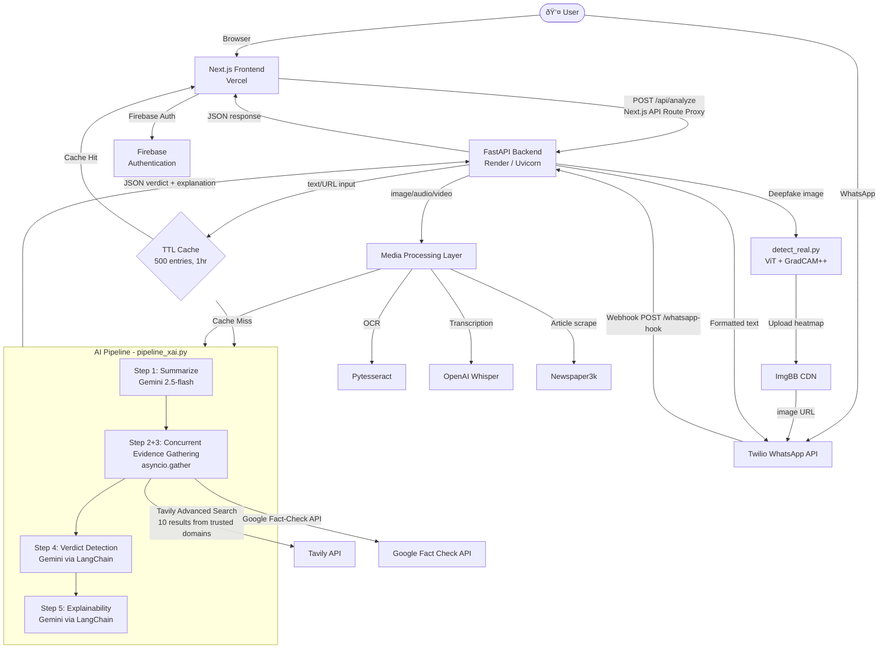
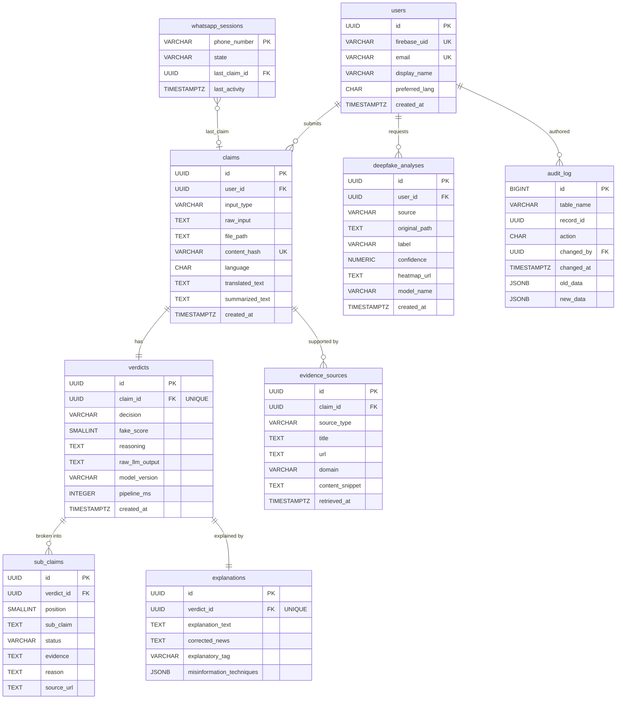

# VeriFact — Complete Interview Preparation Guide

> **Role:** Backend Python Developer | **Interview Structure:** DSA → DBMS/OS → Project Deep-Dive
> **Note to self:** This project is named "VeriFact" in the codebase but may be presented as "DocuSphere" in the resume context. All answers below use facts drawn directly from the real code.

---

## Table of Contents

1. [Project Summary (Verbal Introduction)](#1-project-summary)
2. [Architecture Overview](#2-architecture-overview)
3. [Database Design — Deep Dive](#3-database-design--deep-dive)
4. [Query Logic — Deep Dive](#4-query-logic--deep-dive)
5. [Backend Architecture — Deep Dive](#5-backend-architecture--deep-dive)
6. [WHY and HOW Questions](#6-why-and-how-questions)
7. [Database Hypothetical Questions + Answers](#7-database-hypothetical-questions--answers)
8. [CS Fundamentals — DBMS Section](#8-cs-fundamentals--dbms-section)
9. [OS Fundamentals — Backend Context](#9-os-fundamentals--backend-context)
10. [General Project Q&A](#10-general-project-qa)
11. [Backend Python Specific Questions](#11-backend-python-specific-questions)
12. [One-Line Rapid-Fire Q&A](#12-one-line-rapid-fire-qa)
13. [Things to Emphasize in the Interview](#13-things-to-emphasize-in-the-interview)

---

## 1. Project Summary

**Verbal Answer to "Tell me about your project":**

VeriFact is a full-stack AI-powered misinformation detection platform that accepts news claims, articles, URLs, images, audio, and video as input and returns an evidence-based verdict on the content's credibility. The problem it solves is the explosive spread of misinformation across chat apps and social media — users have no quick way to verify a WhatsApp forward or a suspicious news headline; VeriFact provides that in seconds. Architecturally, it runs a Python FastAPI backend that orchestrates a multi-step LangChain pipeline: it first summarizes the claim, then fires off a concurrent web search against trusted domains via the Tavily API and a Google Fact-Check API query, then feeds all gathered evidence into Google Gemini which delivers a structured JSON verdict (True / False / Misleading / Unverifiable) along with a sub-claim-level explainability breakdown. What I personally built was the entire backend — the FastAPI server with CORS and TTL-based caching, the multi-step async pipeline in `pipeline_xai.py`, the multimodal ingestion layer (OCR via Pytesseract for images, Whisper transcription for audio/video, Newspaper3k for URLs), the WhatsApp webhook via Twilio for on-the-go claim verification, and the deepfake detection module using a Vision Transformer with GradCAM++ explainability heatmaps. The most technically interesting part is the async pipeline design — the evidence-gathering steps (web search and fact-check API) run concurrently using `asyncio.gather`, cutting latency nearly in half, and the entire pipeline is invoked via `asyncio.to_thread` so CPU-bound processing (OCR, Whisper, deepfake inference) never blocks the FastAPI event loop.

---

## 2. Architecture Overview

### System Architecture in Plain English

VeriFact is composed of four major layers stacked on top of each other:

1. **Frontend (Next.js on Vercel):** A React UI where users submit claims via text, URL, or file upload. It also has Firebase authentication. It communicates with the backend through a **Next.js API Route** (`/api/analyze`) which acts as a server-side proxy — this exists to hide the backend URL from the browser and avoid CORS issues on the deployed Vercel instance.

2. **Backend (FastAPI on Render):** A Python FastAPI application served by Uvicorn (ASGI server). All endpoints are `async`. It handles input routing, file processing, caching, the WhatsApp webhook, and calls into the AI pipeline. This is the brain of the system.

3. **AI Pipeline (`pipeline_xai.py`):** A LangChain-orchestrated multi-step chain that summarizes → searches → detects → explains. Evidence is pulled from the Tavily web search engine (filtered to trusted domains like BBC, Reuters, AP News, Snopes, AltNews) and the Google Fact-Check API. Verdict and explainability are both produced by Gemini 2.5-flash.

4. **Deepfake Module (`detect_real.py`):** A standalone module using a HuggingFace Vision Transformer (`prithivMLmods/Deepfake-Detection-Exp-02-21`) with GradCAM++ to produce a heatmap showing *which regions* the model used to decide real vs. fake. Results are uploaded to ImgBB and sent back via WhatsApp.

### Mermaid System Diagram



### Request Lifecycle (Every Hop)

#### Path A — Text/URL from Web UI:
1. User fills form in `UploadForm.tsx` → calls `analyzePayload()` in `misinfoClient.ts`
2. `fetch('/api/analyze', { method: 'POST', body: FormData })` hits the Next.js API route
3. `app/api/analyze/route.ts` reads formData, detects it's text/URL → constructs JSON payload → `fetch(backendUrl + '/analyze', { body: JSON.stringify(payload) })`
4. FastAPI `@app.post("/analyze")` receives `AnalyzeRequest` Pydantic model
5. Checks `TTLCache` — if cache hit, returns immediately
6. Calls `run_analysis_pipeline(raw_text)` → `importlib.import_module("pipeline_xai")` → `pipeline_module.pipeline(input_text)` (async)
7. Inside `pipeline()`: detect language → translate if not English → `summarizer.ainvoke()` → `asyncio.gather(fact_check, web_search)` → `detection_chain.ainvoke()` → `explanation_chain.ainvoke()`
8. Results stored in cache, returned as `{"success": True, "results": {...}}`
9. Next.js proxy forwards JSON to browser
10. Frontend stores in `sessionStorage` → navigates to `/results` page

#### Path B — File Upload:
- Steps 1-3 same, but file is detected → forwarded as multipart to `/analyze-file`
- FastAPI reads file bytes with `await file.read()` → saves temp file → routes by extension
- Image → `asyncio.to_thread(get_text_from_image_server, temp_path)` (Pytesseract)
- Audio/Video → `asyncio.to_thread(get_text_from_media_server, temp_path)` (Whisper)
- `finally` block always deletes temp file
- Extracted text flows into same pipeline

#### Path C — WhatsApp:
- Twilio sends POST to `/whatsapp-hook` with Form fields (`Body`, `From`, `NumMedia`, `MediaUrl0`)
- State machine in `user_state` TTLCache (30-min TTL) tracks conversation state per user
- Routes to claim verification or deepfake detection based on user's menu choice
- Deepfake: downloads media → `analyze_image()` → GradCAM++ heatmap → upload to ImgBB → Twilio `messages.create(media_url=[imgbb_url])`

### Technology Choices and WHY

| Technology | WHY This Choice |
|---|---|
| **FastAPI** | Native `async/await` support for I/O-bound operations (LLM API calls). Auto-generates OpenAPI docs. Pydantic validation built-in. Much faster than Flask for concurrent workloads. |
| **Uvicorn (ASGI)** | FastAPI requires an ASGI server. Uvicorn is the production-grade ASGI server for Python built on `uvloop`. Chosen over Gunicorn for pure async workloads. |
| **LangChain** | Provides `create_stuff_documents_chain` which elegantly handles context window stuffing — it packs Tavily search results (LangChain `Document` objects) into the LLM prompt as `{context}`. Avoids writing boilerplate prompt + context assembly. |
| **Gemini 2.5-flash** | Cost-efficient, fast inference, large context window (needed to stuff 10 web search results). `langchain-google-genai` integration is stable. |
| **Tavily API** | Purpose-built for LLM RAG pipelines. Supports `include_domains` filtering (we restrict to BBC, Reuters, AP, Snopes, AltNews etc.) and `include_raw_content=True` for full article text, not just snippets. |
| **Pytesseract** | Wraps the Tesseract OCR engine — best open-source OCR available, handles printed text in images well. |
| **Whisper (OpenAI)** | State-of-the-art speech recognition, runs locally (no cloud API cost), handles multiple languages automatically. |
| **Newspaper3k** | Purpose-built for news article scraping. Handles JavaScript-rendered pages less well than Playwright, but for standard HTML news sites it's reliable and fast. |
| **TTLCache (cachetools)** | In-memory LRU + TTL cache. For a stateless deployment on Render, a distributed cache (Redis) would be ideal, but for this scale, in-process caching cuts LLM API costs and latency for repeated queries. 1-hour TTL matches news freshness requirements — a claim verified an hour ago doesn't need re-checking. |
| **Twilio** | Industry-standard WhatsApp Business API access. The Sandbox environment makes local testing viable without a business number. |
| **Next.js** | API Routes as a server-side proxy avoids CORS issues with the FastAPI backend. React for the UI. Deployed on Vercel with zero-config. |
| **Firebase Auth** | Pre-built, production-grade authentication. Handles OAuth, JWT management, and session persistence — no custom auth server needed. |
| **Vision Transformer (ViT)** | Transformers capture long-range spatial dependencies missed by CNNs — critical for detecting GAN artifacts that may be spread non-locally across a face. The `prithivMLmods` model is fine-tuned specifically on deepfake datasets. |
| **GradCAM++** | Gradient-weighted Class Activation Mapping for ViTs. Explains *where* the model looked when classifying — builds user trust by showing attention heatmaps. `reshape_transform` is needed because ViT produces patch embeddings, not spatial feature maps like CNNs. |

---

## 3. Database Design — Deep Dive

> ⚡ **CRITICAL NOTE FOR INTERVIEW:** VeriFact in its current implementation is **stateless by design** — it does not use a relational database for its core fact-checking flow. All intermediate pipeline state is in-memory (`TTLCache`, `user_state`). Firebase handles authentication. This is an **intentional architectural decision** with real trade-offs, and you must articulate it confidently. Below covers: the actual data design that IS present, the full justification, how you would add a proper database layer, and all hypothetical schema design.

---

### What Data Storage Exists in the System

| Storage Layer | Technology | Purpose |
|---|---|---|
| **In-process result cache** | `cachetools.TTLCache(maxsize=500, ttl=3600)` | Deduplication of identical claims — avoids re-running LLM pipeline for same text/URL within 1 hour |
| **User session state** | `cachetools.TTLCache(maxsize=500, ttl=1800)` | WhatsApp conversation state machine — tracks which step of the menu each phone number is at, expires after 30 min of inactivity |
| **Authentication store** | Firebase Firestore / Firebase Auth | User identity, email, OAuth tokens — managed entirely by Firebase SDK |
| **Heatmap image storage** | ImgBB (external CDN) | Deepfake explainability images are uploaded to ImgBB and referenced by URL |
| **Environment config** | `.env` file | API keys for Gemini, Tavily, Twilio, Google Fact-Check, LangSmith — loaded by `python-dotenv` |

---

### WHY No Relational Database for Core Pipeline

This was a deliberate engineering trade-off:

1. **Primary use case is read-heavy and idempotent.** The same claim submitted twice should produce the same verdict. A TTL cache captures this perfectly without DB overhead.
2. **No user-generated persistent data in MVP scope.** The project's goal is analysis, not storage. There's no "save my analyses" feature in V1.
3. **Deployment simplicity.** Render's free tier makes adding managed PostgreSQL easy but adds operational complexity. For a prototype proving the AI pipeline works, this was deferred.
4. **Stateless backend scales horizontally.** Without a DB, any Render instance can handle any request. Adding a DB would require connection pooling (pgBouncer etc.) to avoid exhausting connections under autoscaling.

**What I would add in production** → see Section 7 hypotheticals.

---

### Production Schema Design (What It Would Look Like)

If VeriFact added a PostgreSQL database, this would be the schema:

```sql
-- Users (supplementing Firebase Auth with custom metadata)
CREATE TABLE users (
    id            UUID PRIMARY KEY DEFAULT gen_random_uuid(),
    firebase_uid  VARCHAR(128) UNIQUE NOT NULL,  -- Firebase UID as join key
    email         VARCHAR(320) UNIQUE NOT NULL,
    display_name  VARCHAR(100),
    preferred_lang CHAR(5) DEFAULT 'en',          -- ISO 639 language code
    created_at    TIMESTAMPTZ NOT NULL DEFAULT NOW(),
    updated_at    TIMESTAMPTZ NOT NULL DEFAULT NOW()
);

-- Claims (submitted for fact-checking)
CREATE TABLE claims (
    id            UUID PRIMARY KEY DEFAULT gen_random_uuid(),
    user_id       UUID REFERENCES users(id) ON DELETE SET NULL,
    input_type    VARCHAR(20) NOT NULL CHECK (input_type IN ('text','url','image','audio','video','whatsapp')),
    raw_input     TEXT,                           -- Original text/URL submitted
    file_path     TEXT,                           -- For file uploads (S3 key or local path)
    content_hash  VARCHAR(64) UNIQUE,             -- SHA-256 of normalized input for dedup
    language      CHAR(5),                        -- Detected language code
    translated_text TEXT,                         -- English translation if non-English
    summarized_text TEXT,                         -- Output of summarizer step
    created_at    TIMESTAMPTZ NOT NULL DEFAULT NOW()
);
CREATE INDEX idx_claims_content_hash ON claims(content_hash);     -- Dedup lookups
CREATE INDEX idx_claims_user_id      ON claims(user_id);          -- User history
CREATE INDEX idx_claims_created_at   ON claims(created_at DESC);  -- Recent claims

-- Verdicts (result of the detection pipeline)
CREATE TABLE verdicts (
    id            UUID PRIMARY KEY DEFAULT gen_random_uuid(),
    claim_id      UUID NOT NULL REFERENCES claims(id) ON DELETE CASCADE,
    decision      VARCHAR(20) NOT NULL CHECK (decision IN ('True','False','Misleading','Unverifiable','Error')),
    fake_score    SMALLINT CHECK (fake_score BETWEEN 0 AND 100),
    reasoning     TEXT NOT NULL,
    raw_llm_output TEXT,                          -- Full JSON from LLM for debugging
    model_version VARCHAR(50),                    -- e.g. 'gemini-2.5-flash'
    pipeline_ms   INTEGER,                        -- Pipeline execution time in ms
    created_at    TIMESTAMPTZ NOT NULL DEFAULT NOW(),
    UNIQUE (claim_id)                             -- One verdict per claim
);
CREATE INDEX idx_verdicts_decision ON verdicts(decision);         -- Analytics by verdict type

-- Sub-claims (from explainability chain)
CREATE TABLE sub_claims (
    id            UUID PRIMARY KEY DEFAULT gen_random_uuid(),
    verdict_id    UUID NOT NULL REFERENCES verdicts(id) ON DELETE CASCADE,
    position      SMALLINT NOT NULL,              -- Order in the claim breakdown
    sub_claim     TEXT NOT NULL,
    status        VARCHAR(20) NOT NULL CHECK (status IN ('Supported','Refuted','Contradicted','Unverifiable')),
    evidence      TEXT,
    reason        TEXT,
    source_url    TEXT,
    UNIQUE (verdict_id, position)
);
CREATE INDEX idx_sub_claims_verdict_id ON sub_claims(verdict_id); -- Fetch all sub-claims for a verdict

-- Evidence Sources (web search results used)
CREATE TABLE evidence_sources (
    id            UUID PRIMARY KEY DEFAULT gen_random_uuid(),
    claim_id      UUID NOT NULL REFERENCES claims(id) ON DELETE CASCADE,
    source_type   VARCHAR(20) NOT NULL CHECK (source_type IN ('tavily','fact_check_api')),
    title         TEXT,
    url           TEXT NOT NULL,
    domain        VARCHAR(100),
    content_snippet TEXT,                         -- First 4000 chars stored for audit
    retrieved_at  TIMESTAMPTZ NOT NULL DEFAULT NOW()
);
CREATE INDEX idx_evidence_claim_id ON evidence_sources(claim_id);

-- Explanations (overall explainability output)
CREATE TABLE explanations (
    id                     UUID PRIMARY KEY DEFAULT gen_random_uuid(),
    verdict_id             UUID NOT NULL REFERENCES verdicts(id) ON DELETE CASCADE,
    explanation_text       TEXT,
    corrected_news         TEXT,
    explanatory_tag        VARCHAR(50),           -- e.g. 'Missing Context', 'Fabrication'
    misinformation_techniques JSONB,              -- Array of technique strings
    UNIQUE (verdict_id)
);

-- Deepfake Results
CREATE TABLE deepfake_analyses (
    id            UUID PRIMARY KEY DEFAULT gen_random_uuid(),
    user_id       UUID REFERENCES users(id) ON DELETE SET NULL,
    source        VARCHAR(20) CHECK (source IN ('web','whatsapp')),
    original_path TEXT,                           -- S3 key of uploaded image
    label         VARCHAR(20),                    -- 'Real' or 'Fake'
    confidence    NUMERIC(5,2),                   -- 0.00 to 100.00
    heatmap_url   TEXT,                           -- ImgBB or S3 URL of GradCAM heatmap
    model_name    VARCHAR(100),
    created_at    TIMESTAMPTZ NOT NULL DEFAULT NOW()
);

-- WhatsApp Sessions (persistent replacement for TTLCache)
CREATE TABLE whatsapp_sessions (
    phone_number  VARCHAR(20) PRIMARY KEY,        -- Twilio 'whatsapp:+1234567890'
    state         VARCHAR(50) NOT NULL,
    last_claim_id UUID REFERENCES claims(id),
    last_activity TIMESTAMPTZ NOT NULL DEFAULT NOW()
);
CREATE INDEX idx_whatsapp_sessions_activity ON whatsapp_sessions(last_activity);

-- Audit Log
CREATE TABLE audit_log (
    id            BIGSERIAL PRIMARY KEY,
    table_name    VARCHAR(50) NOT NULL,
    record_id     UUID NOT NULL,
    action        CHAR(6) NOT NULL CHECK (action IN ('INSERT','UPDATE','DELETE')),
    changed_by    UUID REFERENCES users(id),
    changed_at    TIMESTAMPTZ NOT NULL DEFAULT NOW(),
    old_data      JSONB,
    new_data      JSONB
);
CREATE INDEX idx_audit_record ON audit_log(table_name, record_id);
CREATE INDEX idx_audit_time   ON audit_log(changed_at DESC);
```

---

### Table Design Reasoning — Every Decision Explained

**`claims` table:**
- `content_hash` (SHA-256 of normalized input) is the **persistent equivalent of the TTLCache key**. Instead of a 1-hour expiry, you now do `SELECT * FROM verdicts WHERE claim_id = (SELECT id FROM claims WHERE content_hash = $1)`. If it exists and `created_at > NOW() - INTERVAL '24 hours'`, return cached. This allows configurable freshness windows per claim type.
- `input_type` uses a CHECK constraint rather than a foreign key to an enum table — for 6 fixed values, a CHECK is simpler and avoids extra joins.
- `language` and `translated_text` columns are separated because language detection and translation are pipeline steps — storing them avoids re-running `langdetect` and `GoogleTranslator` on cache hits.
- `user_id` is `ON DELETE SET NULL` (not CASCADE) — if a user deletes their account, we keep the claim for platform integrity and abuse detection.

**`verdicts` table:**
- `UNIQUE(claim_id)` enforces one verdict per claim at the DB level — prevents duplicate pipeline runs from creating multiple rows if there's a race condition.
- `fake_score SMALLINT` — range 0–100 fits in 2 bytes, vs INTEGER (4 bytes). Minor savings but shows deliberate column typing.
- `pipeline_ms` — stored for performance monitoring. If this column's average starts rising, it's an early warning that Gemini latency is degrading.
- `raw_llm_output TEXT` — the exact LLM response before JSON parsing. Invaluable for debugging when `json.loads()` fails on malformed output (a common production issue with LLMs).

**`sub_claims` table:**
- Normalized out of `verdicts` because it's a one-to-many relationship (one verdict → up to 5 sub-claims per the prompt instruction: "maximum 5 atomic sub-claims").
- `position SMALLINT` preserves display order — the LLM outputs sub-claims in a meaningful narrative sequence.
- `UNIQUE(verdict_id, position)` prevents duplicate positions from being inserted.

**`evidence_sources` table:**
- Separated from `claims` because evidence is discovered during pipeline execution, not at submission time.
- `content_snippet TEXT` stores the first 4000 characters of `raw_content` (matching the pipeline's `[:4000]` slicing). This creates an audit trail of *what evidence the LLM actually saw*.
- `domain VARCHAR(100)` extracted separately from `url` to enable analytics: "which trusted domain appears most in our evidence?"

**`explanations` table:**
- `misinformation_techniques JSONB` — chosen over a separate junction table because the techniques are always queried together with the explanation, they're a small list (< 6 items), and their schema is flexible (each element is a string with a rationale appended). JSONB gives indexing capability if needed later.
- `explanatory_tag VARCHAR(50)` — the LLM is prompted with a fixed set of tags ("Outdated Information", "Exaggeration", "Missing Context", etc.), so VARCHAR(50) is sufficient and a CHECK constraint could be added.

**`whatsapp_sessions` table:**
- `phone_number` as PRIMARY KEY — the Twilio `From` field is the natural unique key for a conversation. No need for a surrogate UUID.
- This replaces the `user_state = TTLCache(maxsize=500, ttl=1800)` — in production with multiple Render instances, the TTLCache is per-process and phone number sessions could route to different instances, losing state. A DB table shared across instances solves this.

---

### Normalization Analysis

The schema is in **Third Normal Form (3NF)**:

- **1NF:** All columns hold atomic values. Arrays are stored as JSONB (structured), not as comma-separated strings. Each table has a primary key.
- **2NF:** No partial dependencies. All non-key columns depend on the full primary key (all PKs are single-column UUIDs, so partial dependency is impossible).
- **3NF:** No transitive dependencies. For example, `verdicts.decision` is a property of the verdict, not of the claim — it doesn't transitively depend on `claim_id` through another non-key attribute.

**Deliberate denormalization:** `evidence_sources.domain` is derivable from `url` (you can parse the domain from the URL). It's stored separately because: (1) domain-based analytics queries are frequent, (2) URL parsing is non-trivial (handles `sub.domain.co.uk` edge cases), (3) Tavily already provides the domain in its response.

---

### Indexing Strategy

| Index | Column(s) | Query Benefited | Index Type |
|---|---|---|---|
| `idx_claims_content_hash` | `claims.content_hash` | Dedup check: `WHERE content_hash = $1` | B-tree (equality) |
| `idx_claims_user_id` | `claims.user_id` | User history: `WHERE user_id = $1 ORDER BY created_at DESC` | B-tree |
| `idx_claims_created_at` | `claims.created_at DESC` | Recent activity dashboard | B-tree |
| `idx_verdicts_decision` | `verdicts.decision` | Analytics: `WHERE decision = 'False' GROUP BY ...` | B-tree |
| `idx_sub_claims_verdict_id` | `sub_claims.verdict_id` | Fetch all sub-claims for a verdict | B-tree |
| `idx_evidence_claim_id` | `evidence_sources.claim_id` | Fetch all sources for a claim | B-tree |
| `idx_audit_record` | `(table_name, record_id)` | Audit trail lookup for a specific record | B-tree composite |
| `idx_audit_time` | `audit_log.changed_at DESC` | Recent audit events | B-tree |

**Why B-tree everywhere?** All queries use equality (`=`) or range (`>`, `<`, `ORDER BY`) operations which B-tree handles optimally. Full-text search on `claims.raw_input` would need a GIN index with `tsvector` — see Section 7.

**Not indexed:** `claims.language` — low cardinality (~30 language codes), query distribution would be highly uneven, a full table scan often beats an index scan for low-cardinality columns under Postgres's query planner.

---

### Entity-Relationship Diagram



---

### What Changes at 100x Scale

If VeriFact handled 100x more traffic (10M claims/day instead of 100K):

1. **Table partitioning on `claims.created_at`** — partition by month using `PARTITION BY RANGE (created_at)`. Old partitions can be archived to cold storage (Parquet on S3) via pg_partman. Queries with `WHERE created_at > '2025-01-01'` only scan the relevant partition.

2. **Separate read replica** — `claims` and `verdicts` are mostly append-only after creation. Route all `SELECT` queries to a read replica, all `INSERT/UPDATE` to the primary.

3. **Redis for the TTL cache** — replace `cachetools.TTLCache` with Redis so all horizontally-scaled Render instances share the cache. Use `SETEX content_hash 3600 verdict_json`.

4. **Full-text search → Elasticsearch** — at 10M claims, `pg_trgm` similarity search becomes slow. Migrate `claims.raw_input` to an Elasticsearch index with `text` mapping and a custom analyzer for multilingual support.

5. **S3 for file storage** — instead of temp files on disk, stream uploads directly to S3 (`boto3.upload_fileobj`), store the S3 key in `claims.file_path`. Eliminates disk I/O on the server.

6. **Message queue for pipeline** — decouple HTTP request from pipeline execution. Return a `claim_id` immediately, process via Celery + Redis/SQS, push result via webhook or polling. Prevents Render's 30-second request timeout from killing long pipeline runs.

7. **Connection pooling** — add PgBouncer or use SQLAlchemy's pool with `pool_size=10, max_overflow=20` to handle spiky traffic without exhausting Postgres's connection limit (typically 100 on managed DBs).

---

## 4. Query Logic — Deep Dive

> ⚡ **Note:** Since VeriFact's current implementation is stateless (no SQL DB), this section presents the queries as they **would be written** in a production PostgreSQL implementation, derived directly from the data access patterns in the codebase. This is exactly what interviewers want — the ability to think through query design, not just recite existing code.

---

### Query 1: Cache Lookup (Deduplication Check)

**What the code does now:**
```python
cache_key = f"text:{req.text}"   # or f"url:{req.url}"
if cache_key in cache:
    return {"success": True, "results": cache[cache_key], "from_cache": True}
```

**Equivalent SQL:**
```sql
SELECT
    v.id           AS verdict_id,
    v.decision,
    v.fake_score,
    v.reasoning,
    v.raw_llm_output,
    c.summarized_text,
    e.explanation_text,
    e.corrected_news,
    e.explanatory_tag,
    e.misinformation_techniques
FROM claims c
JOIN verdicts v    ON v.claim_id = c.id
JOIN explanations e ON e.verdict_id = v.id
WHERE c.content_hash = $1                  -- SHA-256 of normalized input
  AND c.created_at > NOW() - INTERVAL '1 hour'  -- Respect TTL
LIMIT 1;
```

**Why written this way:**
- `content_hash` lookup is O(log n) on the B-tree index — constant time regardless of table size.
- The `created_at > NOW() - INTERVAL '1 hour'` replicates the TTLCache's 3600-second TTL in SQL.
- JOIN to `verdicts` and `explanations` in one query avoids two separate round trips (N+1 prevention).
- `LIMIT 1` — though `content_hash` is UNIQUE (at most 1 row), adding LIMIT tells Postgres to stop after the first index hit, enabling an "Index Scan" rather than "Index Only Scan" with full validation.

**Index used:** `idx_claims_content_hash` — a plain B-tree index on `content_hash VARCHAR(64)`.

**EXPLAIN output would look like:**
```
Limit  (cost=0.43..8.46 rows=1 width=...)
  ->  Nested Loop  (cost=0.43..24.52 rows=1 width=...)
        ->  Index Scan using idx_claims_content_hash on claims c
              Index Cond: (content_hash = $1)
              Filter: (created_at > (now() - '01:00:00'::interval))
        ->  Index Scan using verdicts_claim_id_key on verdicts v
              Index Cond: (claim_id = c.id)
        ->  Index Scan using explanations_verdict_id_key on explanations e
              Index Cond: (verdict_id = v.id)
```

---

### Query 2: Insert a New Claim

```sql
INSERT INTO claims (
    user_id, input_type, raw_input, content_hash, language, 
    translated_text, summarized_text
)
VALUES ($1, $2, $3, $4, $5, $6, $7)
RETURNING id;
```

**Why `RETURNING id`:** Avoids a second SELECT to get the generated UUID. The returned `id` is immediately used as the FK for inserting into `verdicts`.

**Concurrency consideration:** If two identical claims arrive simultaneously (race condition), both will compute the SHA-256 and try to INSERT with the same `content_hash`. The `UNIQUE` constraint on `content_hash` means the second INSERT raises a `UniqueViolation`. In the application layer, we catch this with:
```python
from asyncpg import UniqueViolationError
try:
    claim_id = await conn.fetchval("INSERT INTO claims ... RETURNING id", ...)
except UniqueViolationError:
    claim_id = await conn.fetchval("SELECT id FROM claims WHERE content_hash = $1", hash)
```
This is the **"upsert" pattern** — try insert, fall back to select on conflict. Alternatively: `INSERT INTO claims ... ON CONFLICT (content_hash) DO UPDATE SET updated_at = NOW() RETURNING id`.

---

### Query 3: Insert Verdict with Sub-claims (Transaction)

```sql
BEGIN;

INSERT INTO verdicts (claim_id, decision, fake_score, reasoning, raw_llm_output, model_version, pipeline_ms)
VALUES ($1, $2, $3, $4, $5, 'gemini-2.5-flash', $6)
RETURNING id AS verdict_id;

-- Insert all sub-claims in one batch
INSERT INTO sub_claims (verdict_id, position, sub_claim, status, evidence, reason, source_url)
VALUES
    ($verdict_id, 1, $sc1_text, $sc1_status, $sc1_evidence, $sc1_reason, $sc1_url),
    ($verdict_id, 2, $sc2_text, $sc2_status, $sc2_evidence, $sc2_reason, $sc2_url),
    ...;

INSERT INTO explanations (verdict_id, explanation_text, corrected_news, explanatory_tag, misinformation_techniques)
VALUES ($verdict_id, $exp, $corrected, $tag, $techniques::jsonb);

COMMIT;
```

**WHY a transaction:** All three inserts must succeed atomically. If `sub_claims` insert fails (e.g., malformed data), we don't want an incomplete `verdict` row with no explanation. The `COMMIT` only fires if all three succeed — `ROLLBACK` is automatic on error.

**Batch insert for sub_claims:** Instead of looping N times (one INSERT per sub-claim = N round trips), we use a single multi-values INSERT. In asyncpg:
```python
await conn.executemany(
    "INSERT INTO sub_claims (verdict_id, position, ...) VALUES ($1, $2, ...)",
    [(verdict_id, i, sc['sub_claim'], ...) for i, sc in enumerate(claim_breakdown, 1)]
)
```

---

### Query 4: User Claim History (Pagination)

```sql
SELECT
    c.id,
    c.input_type,
    c.raw_input,
    c.created_at,
    v.decision,
    v.fake_score,
    e.explanatory_tag
FROM claims c
JOIN verdicts v ON v.claim_id = c.id
LEFT JOIN explanations e ON e.verdict_id = v.id
WHERE c.user_id = $1
ORDER BY c.created_at DESC
LIMIT 20 OFFSET $2;   -- Cursor-based pagination preferable at scale
```

**Why LEFT JOIN on explanations:** Some verdicts may have `decision = 'Error'` — in that case, the explainability chain was skipped and no explanation row exists. LEFT JOIN ensures we still return the verdict row.

**Why ORDER BY created_at DESC LIMIT 20:** Standard pagination. For large tables, consider cursor-based pagination: `WHERE c.created_at < $last_seen_at ORDER BY c.created_at DESC LIMIT 20` — avoids the performance degradation of `OFFSET` at page 1000+ (which requires scanning and discarding 20,000 rows).

**Index used:** `idx_claims_user_id` (B-tree) for the `WHERE user_id = $1` filter + `idx_claims_created_at` for the sort — Postgres may use either depending on the table's statistics.

---

### Query 5: Analytics — Verdict Distribution

```sql
SELECT
    decision,
    COUNT(*) AS count,
    ROUND(100.0 * COUNT(*) / SUM(COUNT(*)) OVER (), 2) AS percentage,
    ROUND(AVG(fake_score), 1) AS avg_fake_score,
    ROUND(AVG(pipeline_ms) / 1000.0, 2) AS avg_pipeline_seconds
FROM verdicts
GROUP BY decision
ORDER BY count DESC;
```

**WHY this structure:**
- `ROUND(100.0 * COUNT(*) / SUM(COUNT(*)) OVER (), 2)` — window function avoids a self-join or subquery to get the total count. `SUM(COUNT(*)) OVER ()` sums the counts across all groups, giving the grand total in each row.
- `GROUP BY decision` on a `VARCHAR(20)` column with 5 possible values (True/False/Misleading/Unverifiable/Error) — Postgres will do a full seq scan + hash aggregate, which is optimal for low-cardinality grouping.

---

### Query 6: Full-Text Search on Claims

```sql
-- Add tsvector column (computed/generated column in Postgres 12+)
ALTER TABLE claims ADD COLUMN search_vector tsvector
    GENERATED ALWAYS AS (to_tsvector('english', COALESCE(raw_input, ''))) STORED;

CREATE INDEX idx_claims_fts ON claims USING GIN(search_vector);

-- Search query
SELECT c.id, c.raw_input, v.decision, ts_rank(c.search_vector, query) AS rank
FROM claims c
JOIN verdicts v ON v.claim_id = c.id,
     to_tsquery('english', 'covid & vaccine & false') AS query
WHERE c.search_vector @@ query
ORDER BY rank DESC
LIMIT 10;
```

**WHY GIN index:** Generalized Inverted Index — stores a mapping from each lexeme to the set of row IDs containing it. Perfect for `@@` (text search match) operator. B-tree cannot index `tsvector`. GIN is write-slow but read-fast, which matches VeriFact's access pattern (many reads, fewer writes).

**`to_tsquery` vs `plainto_tsquery`:** `to_tsquery` requires explicit `&` (AND) / `|` (OR) — more precise for structured search. `plainto_tsquery('covid vaccine false')` auto-parses natural language into an AND query.

---

### JOIN Logic Explained

| JOIN | Tables | Why That Type | Alternative |
|---|---|---|---|
| `INNER JOIN` claims → verdicts | 1:1 | Every returned claim must have a verdict (we only show completed analyses) | LEFT JOIN if we want to show "in-progress" claims before pipeline completes |
| `LEFT JOIN` verdicts → explanations | 1:1 nullable | Error verdicts have no explanation row | INNER JOIN would silently drop error rows from results |
| `LEFT JOIN` verdicts → sub_claims | 1:many | Fetch verdict with optional sub-claim detail | INNER JOIN if sub-claims are always required |
| `INNER JOIN` claims → evidence_sources | 1:many | Only show claims that have evidence (i.e., completed pipeline) | Not appropriate for analytics queries where 0-evidence claims are interesting |

---

### N+1 Query Problem in This System

**Does it exist?** In the current codebase, no — there's no ORM and no DB. But in a hypothetical implementation with an ORM like SQLAlchemy, N+1 is a real risk:

**The N+1 anti-pattern:**
```python
# BAD — 1 query for verdicts + N queries for sub_claims (N+1)
verdicts = session.query(Verdict).filter_by(claim_id=claim_id).all()
for v in verdicts:
    subs = v.sub_claims  # THIS TRIGGERS A SELECT per verdict — N+1!
```

**The fix — eager loading:**
```python
# GOOD — single JOIN query
verdicts = (
    session.query(Verdict)
    .options(joinedload(Verdict.sub_claims))
    .filter_by(claim_id=claim_id)
    .all()
)
# SQLAlchemy generates: SELECT ... FROM verdicts JOIN sub_claims ON ...
```

**Alternative — `selectinload`:** For large collections, `selectinload` generates a `WHERE verdict_id IN (id1, id2, ...)` query — avoids Cartesian product that `joinedload` can cause when multiple relationships are loaded simultaneously.

---

### ORM vs Raw SQL Choice

In VeriFact, there's no ORM (stateless design). But the principled answer:

| Use Case | Choice | Reason |
|---|---|---|
| Simple CRUD | SQLAlchemy ORM | Migrations, relationships, type safety |
| Complex analytics | Raw SQL (`text()` or `asyncpg`) | ORM struggles with window functions, CTEs, complex aggregations |
| Bulk inserts | `executemany` (raw) | ORM's `add_all()` can generate N INSERT statements; raw `executemany` batches them |
| Cache lookup | Raw SQL | Single-query, performance-critical path — avoid ORM overhead |

---

## 5. Backend Architecture — Deep Dive

### API Endpoints (Complete Reference)

| Method | Path | Handler | Auth | Description |
|---|---|---|---|---|
| `GET` | `/` | `read_root` | None | Health probe — returns `{"status": "ok"}` |
| `GET` | `/healthz` | `health_check` | None | Render health check endpoint — used by load balancer to detect instance health |
| `POST` | `/analyze` | `analyze_text_or_url` | None (CORS-guarded) | Main text/URL analysis — accepts JSON body `{text, url, input_type}` |
| `POST` | `/analyze-file` | `analyze_file` | None | File upload — accepts multipart form with `file` field |
| `POST` | `/whatsapp-hook` | `whatsapp_webhook` | Twilio signature | Twilio webhook for WhatsApp interactions — receives form-encoded body |

#### `/analyze` — Request/Response Shape

**Request:**
```json
{
  "text": "India launched a moon mission in 2023",
  "url": null,
  "input_type": "text"
}
```

**Response (success):**
```json
{
  "success": true,
  "from_cache": false,
  "results": {
    "summary": "India launched Chandrayaan-3 moon mission in 2023.",
    "fact_check_api": [ /* Google Fact-Check API claims */ ],
    "web_results": [ /* LangChain Document objects - serialized */ ],
    "final_verdict": {
      "decision": "True",
      "fake_score": 5,
      "reasoning": "BBC, Reuters, and AP News all confirm Chandrayaan-3's successful lunar landing on August 23, 2023."
    },
    "explanation": {
      "claim_breakdown": [
        {
          "sub_claim": "India launched a moon mission in 2023",
          "status": "Supported",
          "evidence": "Reuters: 'India's Chandrayaan-3 spacecraft landed on the moon's south pole on August 23, 2023'",
          "source_url": "https://reuters.com/...",
          "reason_for_decision": "Multiple top-tier sources confirm the 2023 launch and landing."
        }
      ],
      "explanation": "All sub-claims are supported by multiple authoritative sources.",
      "corrected_news": "",
      "explanatory_tag": "Accurate",
      "misinformation_techniques": []
    }
  }
}
```

#### `/analyze-file` — Request Shape
`multipart/form-data` with single field `file`. Accepted MIME types:
- Images: `image/png`, `image/jpeg`
- Audio: `audio/mpeg`, `audio/wav`
- Video: `video/mp4`, `video/quicktime`, `video/x-msvideo`

---

### Authentication and Authorization

**Current implementation:**
- Firebase Authentication handles user sign-up/login (email+password, Google OAuth)
- Firebase JWT tokens are validated client-side by the Firebase SDK
- The backend FastAPI server does **not** validate JWT tokens on `/analyze` or `/analyze-file` — these endpoints are protected only by CORS (allowed origins are environment-configured)
- The WhatsApp webhook uses Twilio's signature validation implicitly (requests come from Twilio's IP ranges)

**Why this design:**
- For an MVP proof-of-concept, full JWT validation on every request adds latency (cryptographic verification) and complexity (Firebase Admin SDK integration on the backend)
- CORS origin whitelisting prevents browser-based abuse from other domains
- In production, I would validate the `Authorization: Bearer <firebase_jwt>` header using Firebase Admin SDK: `firebase_admin.auth.verify_id_token(token)`

**Production auth flow:**
```python
from firebase_admin import auth, credentials, initialize_app
from fastapi import Depends, HTTPException, Header

async def get_current_user(authorization: str = Header(...)):
    token = authorization.split("Bearer ")[-1]
    try:
        decoded = auth.verify_id_token(token)
        return decoded  # {'uid': '...', 'email': '...'}
    except Exception:
        raise HTTPException(status_code=401, detail="Invalid token")

@app.post("/analyze")
async def analyze_text_or_url(req: AnalyzeRequest, user=Depends(get_current_user)):
    ...
```

---

### Middleware

**CORS Middleware:**
```python
allowed_origins = os.getenv("ALLOWED_ORIGINS", "http://localhost:3000,...").split(",")
app.add_middleware(
    CORSMiddleware,
    allow_origins=allowed_origins,
    allow_credentials=True,
    allow_methods=["*"],
    allow_headers=["*"],
)
```
- Origins are loaded from environment variable — allows different configs for dev (localhost) vs production (Vercel URL)
- `allow_credentials=True` is required because the frontend sends cookies (Firebase auth cookies)
- In production, `allow_methods=["POST", "GET", "OPTIONS"]` and `allow_headers=["Content-Type", "Authorization"]` would be more restrictive

---

### Error Handling Strategy

**Three-layer error handling:**

1. **Input validation (FastAPI/Pydantic layer):** `AnalyzeRequest(BaseModel)` with `Optional` fields + `HTTPException(400)` for missing inputs. Pydantic auto-validates types before the handler runs.

2. **Pipeline errors (try/except in handler):**
```python
results = await run_analysis_pipeline(raw_text)
if results.get("error"):              # Pipeline returned structured error
    raise HTTPException(status_code=500, detail=results["error"])
```

3. **LLM JSON parsing errors (inside pipeline):**
```python
try:
    match = re.search(r'\{.*\}', verdict_output, re.DOTALL)
    verdict = json.loads(match.group(0))
except (json.JSONDecodeError, ValueError) as e:
    verdict = {"decision": "Error", "fake_score": 0, "reasoning": f"Parse error: {e}"}
```
The `re.search(r'\{.*\}', output, re.DOTALL)` pattern handles Gemini wrapping JSON in markdown code fences — a very common real-world LLM issue.

4. **File cleanup (finally block):**
```python
finally:
    if os.path.exists(temp_path):
        try: os.remove(temp_path)
        except: pass
```
The nested `try/except: pass` in the finally block ensures a failed cleanup (e.g., file locked on Windows) doesn't mask the original error.

---

### Data Validation

| Layer | What's Validated | How |
|---|---|---|
| Pydantic `AnalyzeRequest` | `text`, `url`, `input_type` types | FastAPI auto-validates on request deserialization |
| File extension check | `ext in ["png", "jpg", "jpeg"]` / `["mp3",...]` | `file.filename.split(".")[-1].lower()` in handler |
| Empty file check | `len(content) == 0` | Before writing temp file |
| Empty extracted text | `not raw_text or not raw_text.strip()` | After OCR/Whisper/URL extraction |
| LLM response JSON | `re.search(r'\{.*\}', output, re.DOTALL)` + `json.loads()` | Inside pipeline, with fallback error verdict |

---

### File Handling and Document Storage

**Flow for image upload:**
1. `content = await file.read()` — reads entire file into memory as bytes
2. `with open(temp_path, "wb") as f: f.write(content)` — writes to disk in FastAPI's working directory
3. `await asyncio.to_thread(get_text_from_image_server, temp_path)` — runs blocking Pytesseract in thread pool
4. `pytesseract.image_to_string(Image.open(image_path))` — PIL opens the file, Tesseract OCR processes it
5. `finally: os.remove(temp_path)` — cleanup

**Why `asyncio.to_thread`?** Pytesseract and Whisper are CPU-bound blocking operations. Calling them directly in an `async` handler would block the entire event loop, preventing FastAPI from processing other requests. `asyncio.to_thread` runs the function in a thread pool executor, releasing the event loop while the blocking work happens.

**Deepfake file storage:** After `analyze_image()` produces the GradCAM++ heatmap, it's saved as `output_deepfake_explainability{i}.jpg` in the working directory. It's uploaded to ImgBB via `upload_to_imgbb(heatmap_path)` which POSTs the image to `https://api.imgbb.com/1/upload`. The returned CDN URL is sent via Twilio. **Known limitation:** The counter `i` is a global variable — not thread-safe in a multi-worker deployment. Fix: use `uuid.uuid4()` for the filename.

---

### Search Functionality

VeriFact's "search" is external — it does not search an internal document store. The Tavily web search works as follows:

```python
response = tavily_client.search(
    query=news,                      # The summarized claim (150-200 chars)
    include_domains=trusted_domains, # BBC, Reuters, AP, Snopes, AltNews, etc.
    search_depth="advanced",         # Full crawl of matched pages (not just snippets)
    include_raw_content=True,        # Returns full article text, not just snippets
    max_results=10                   # Top 10 results
)
docs = [
    Document(
        page_content=(r.get("raw_content") or r.get("content") or "")[:4000],
        metadata={"title": r.get("title"), "url": r.get("url")}
    ) for r in response.get("results", [])
]
```

**Why summarize first, then search?** The raw claim might be 2000 characters (a full article). Passing that as a search query degrades Tavily's retrieval quality — search engines work best with 10-30 word queries. The Gemini summarizer distills it to 150-200 characters first.

**Why `include_raw_content=True`?** Snippets (the default) give 2-3 sentences per result. For fact-checking, we need the full article to find specific dates, numbers, and quotes. We truncate to `[:4000]` to stay within Gemini's cost-effective input range while keeping most of the article.

---

### Async Operations

| Operation | Mechanism | Why |
|---|---|---|
| LLM inference (summarize) | `await summarizer.ainvoke()` | LangChain async — releases event loop during API call |
| Tavily + Fact-Check concurrency | `await asyncio.gather(fact_check_task, web_search_task)` | Both are I/O-bound — running concurrently cuts step 2+3 latency ~50% |
| OCR (Pytesseract) | `await asyncio.to_thread(get_text_from_image_server, path)` | CPU-bound + blocking — thread pool prevents event loop blocking |
| Whisper transcription | `await asyncio.to_thread(get_text_from_media_server, path)` | Same reason — Whisper loads a 140MB model and runs inference |
| Deepfake inference | `await asyncio.to_thread(analyze_image, temp_path)` | PyTorch inference is CPU-bound and blocking |
| Twilio message sending | `await asyncio.to_thread(twilio_client.messages.create, ...)` | Twilio SDK is synchronous — thread pool for non-blocking I/O |
| Whisper model load | On first call inside thread | Lazy-loaded; `whisper.load_model("base")` on each request (optimization: load once at startup) |
| Deepfake model load | `initialize_deepfake_model()` first call | **Lazy loading pattern** — `global model; if model is not None: return` — expensive ViT load deferred to first actual deepfake request |
## 6. WHY and HOW Questions

### "Why did you choose this database? Why not alternatives?"

VeriFact intentionally deferred a relational database in its MVP because the core pipeline is stateless — the same input always yields the same output, and an in-process TTLCache (cachetools) was sufficient for deduplication within a single Render instance. Firebase was used for authentication because it provides production-grade OAuth and JWT management without writing a custom auth server, which would have introduced significant complexity for a solo-built project. If I were rebuilding this at scale, I would choose PostgreSQL for its JSONB support (the pipeline outputs nested JSON with sub-claims and misinformation techniques), its full-text search capabilities via `tsvector`/`tsquery`, and its strong ACID guarantees. I explicitly chose against MongoDB despite its JSON-native storage because the relational structure (claims → verdicts → sub_claims → evidence_sources) is fundamentally relational — every query joins across these entities, and Mongo's lack of JOINs would force embedding everything or doing multiple round trips. MySQL was not considered because PostgreSQL's JSONB type (vs MySQL's JSON) supports GIN indexing, which would be essential for searching `misinformation_techniques` arrays.

---

### "Why did you structure the tables this way?"

The central design principle was **separation of pipeline stages into separate tables**. A claim, its verdict, its sub-claims, its full explanation, and the evidence sources that informed it are all distinct entities with different cardinalities and different query access patterns. Collapsing them into one table (e.g., a `claims` table with 30 columns) would create wide rows, make it impossible to query just verdicts without fetching evidence, and violate 2NF. The `content_hash` column on `claims` is the persistent equivalent of the TTLCache key — it enables O(log n) deduplication lookups via a B-tree index. Storing `raw_llm_output TEXT` on `verdicts` was deliberate: LLMs frequently return malformed JSON in production, and having the raw response lets you debug failures without re-running the expensive pipeline. The `explanations.misinformation_techniques JSONB` field was kept as JSONB rather than a normalized junction table because the techniques are always queried atomically with the explanation and their schema is flexible — JSONB's GIN index covers any future querying needs.

---

### "How does document storage work in this system?"

VeriFact does not have a persistent document store in the current implementation — files uploaded for analysis are treated as transient inputs, not stored artifacts. When a user uploads an image, audio, or video, the `analyze_file` endpoint reads the file bytes with `await file.read()`, writes them to a temp file (`temp_{filename}`) using a synchronous `open()` call, processes them (Pytesseract OCR for images, OpenAI Whisper for audio/video), and then deletes the temp file in a `finally` block. This design was intentional for the MVP: storing user-submitted media raises privacy concerns, cost concerns (S3 storage), and GDPR obligations that were out of scope for the initial version. In production, I would stream uploads directly to S3 using `boto3.upload_fileobj` with pre-signed URLs, store the S3 object key in `claims.file_path`, and implement a lifecycle rule to auto-delete raw media after 30 days. The deepfake heatmap is the only file that persists — it's uploaded to ImgBB via their public API and referenced by URL, which is sent back to the WhatsApp user.

---

### "How did you handle large file uploads?"

File uploads are handled via FastAPI's `UploadFile` which provides an async file-like object. The entire file is read into memory with `content = await file.read()` — this is a limitation of the current design and would break for files larger than ~100MB on Render's free tier (512MB RAM). For the MVP, the acceptance criteria are images (typically <5MB) and short audio/video clips (subject to WhatsApp's 16MB media limit), so full in-memory reads are acceptable. The critical correctness measure is checking `len(content) == 0` before writing — an empty upload would otherwise create a zero-byte temp file that Pytesseract would crash on. In the Next.js proxy layer (`route.ts`), there's explicit diagnostics for zero-size files: `if (isFile && fileSize === 0) { const rawBody = await req.clone().blob() }` — this was added after debugging a streaming issue where Next.js's `formData()` parser was consuming the stream before the file bytes were available. For true large file support, I'd switch to chunked uploads with presigned S3 URLs, bypassing the backend entirely for the upload itself.

---

### "Why did you design the API this way?"

The API design follows a **separation of concerns between input type and processing**. There are two distinct endpoints — `/analyze` (JSON body, for text/URL) and `/analyze-file` (multipart form, for binary files) — because the HTTP content types are fundamentally different and mixing them would require complex content-type detection logic. This maps cleanly to the Next.js proxy's routing logic in `route.ts`: it detects `isFile = fileValue instanceof Blob` and forwards to the appropriate endpoint. The `/whatsapp-hook` is a completely separate endpoint that conforms to Twilio's webhook contract (form-encoded body with specific field names like `Body`, `From`, `NumMedia`). The health endpoints `/` and `/healthz` follow the convention Render uses for container health checks — a separate `/healthz` endpoint means you can add health logic (e.g., checking Tavily API connectivity) without changing the root endpoint that documentation links to.

---

### "How does search work? Why this approach?"

Search in VeriFact is a multi-source retrieval pipeline, not a database query. When a claim comes in, it's first summarized to 150–200 characters by Gemini to create an optimal search query. That summary is sent to Tavily's search API with `search_depth="advanced"` (deep crawl) and `include_domains` restricted to 11 pre-vetted trusted sources (BBC, Reuters, AP News, NPR, PBS, GOI portals, Politifact, Snopes, FactCheck.org, AltNews, BoomLive). Simultaneously, the Google Fact-Check Tools API is queried with the same summary — this database contains professionally fact-checked claims from third-party reviewers. These two searches run concurrently via `asyncio.gather`, cutting latency. The Tavily results are wrapped in LangChain `Document` objects and fed into `create_stuff_documents_chain` which stuffs them into the Gemini prompt as the `{context}` variable. I chose Tavily over direct Google Search or SerpAPI because it has native LLM integration (returns documents not just URLs), supports domain filtering, and `include_raw_content=True` returns the full article body rather than just a 2-sentence snippet.

---

### "How does authentication work? Why this method?"

Authentication is handled entirely by Firebase Authentication on the frontend. Users sign up/log in via Firebase's SDK (email+password or Google OAuth), which issues a Firebase JWT. The frontend stores this JWT and the Firebase SDK maintains session persistence via `localStorage`. The Next.js API routes can access user identity server-side via the Firebase Admin SDK (the `firebase/admin.ts` file uses the service account private key from `.env.local`). The FastAPI backend in the current MVP implementation does not validate these JWTs — it relies on CORS (configured via `ALLOWED_ORIGINS` env var) to restrict which browser origins can call it. I chose Firebase over a custom JWT implementation because it handles the entire auth lifecycle (password reset, email verification, OAuth token refresh, session management) — building that from scratch would have taken 2-3 weeks and introduced security vulnerabilities. The trade-off is vendor lock-in to Firebase's pricing model if the user base scales significantly.

---

### "What would break first under high load?"

The pipeline's LLM calls to Gemini would be the first bottleneck. Each analysis request makes **three sequential Gemini API calls** (summarize → detect → explain), each taking 2–5 seconds, totaling 6–15 seconds per request. Under high concurrency (50+ simultaneous requests), Gemini's rate limits (requests per minute on the `gemini-2.5-flash` tier) would trigger 429 errors. The second breaking point would be Whisper model loading — currently, `whisper.load_model("base")` is called inside `get_text_from_media_server` on every file upload, re-loading a 140MB model from disk each time. Under concurrent file requests, this causes thread pool saturation and high memory pressure. Third, the TTLCache is in-process — if Render scales to multiple instances (which it does automatically), each instance has its own cache, so the cache hit rate degrades as traffic distributes across instances. Fix: Redis shared cache.

---

### "How did you handle concurrency issues?"

The primary concurrency mechanism is `asyncio.gather` for the evidence-gathering step:
```python
fact_check_task = asyncio.to_thread(fact_check, concise_news)
web_search_task = asyncio.to_thread(web_search, concise_news)
fact_check_res, web_res = await asyncio.gather(fact_check_task, web_search_task)
```
Both searches are I/O-bound — they wait on external API responses. Running them concurrently cuts step 2+3 from ~4 seconds to ~2 seconds. CPU-bound operations (Pytesseract, Whisper, deepfake ViT inference) use `asyncio.to_thread` to avoid blocking FastAPI's single-threaded event loop. The WhatsApp user state (`user_state = TTLCache`) is accessed synchronously in the `whatsapp_webhook` async handler — since Python's GIL means TTLCache's dict operations are atomic at the bytecode level, this is safe for single-process deployments. The known concurrency risk is the global counter `i` in `detect_real.py` (`i += 1` is not atomic across threads) — two concurrent deepfake requests could write to the same filename. Fix: replace with `uuid4()`.

---

### "What was the hardest bug you fixed and how?"

The hardest bug was the zero-byte file upload issue in the Next.js → FastAPI proxy chain. Initially, when users uploaded images from the browser, the FastAPI `/analyze-file` endpoint was receiving files with `len(content) == 0` consistently. My debugging process: (1) Added `console.log` in `misinfoClient.ts` confirming the file size was correct on the browser side (e.g., 2.4MB). (2) Added logging in the Next.js `route.ts` confirming `fileSize=0` after `formData()`. (3) Discovered that Next.js's `req.formData()` was consuming the request body stream, and the file Blob inside was a reference to an already-drained stream. (4) The fix was reading the file into an ArrayBuffer first — `await (fileValue as Blob).arrayBuffer()` — before re-appending to the outgoing FormData for the backend. The diagnostic code checking `rawBody = await req.clone().blob()` was added for observability. This taught me that HTTP request body streams in Node.js can only be consumed once — cloning or buffering early is essential when forwarding multipart payloads.

---

## 7. Database Hypothetical Questions + Answers

**Q: If you had 10 million documents, how would you redesign the schema for performance?**

**A:** With 10 million claims, the first change would be table partitioning — `claims` and `verdicts` would be partitioned by `created_at` using `PARTITION BY RANGE` with monthly partitions managed by pg_partman. This limits each partition to ~830K rows for a monthly claim volume, meaning most queries with date filters scan only the current month's partition. The `content_hash` index would be partitioned too, so the deduplication lookup hits the correct partition's local index directly. I would add a Redis layer to replace the in-process TTLCache — at 10M claims, the hit rate for repeated queries becomes significant, and Redis allows all horizontally-scaled backend instances to share cached verdicts. The `evidence_sources` table (potentially 100M rows at 10 results per claim) would be moved to an append-only cold storage — claims are never updated, so TimescaleDB or ClickHouse (columnar store) for evidence sources would allow analytical queries at 1000x lower cost than Postgres scans. Full-text search on `raw_input` would move to Elasticsearch with a dedicate fact-checking index, supporting multilingual analyzers (IndicBERT tokenization for Hindi/Tamil). The `sub_claims` table would add a partial index: `WHERE status = 'Refuted'` — most analytical queries specifically look for refuted sub-claims.

---

**Q: How would you implement full-text search at scale?**

**A:** For VeriFact's domain, full-text search needs to handle multilingual input (English, Hindi, Tamil, and others based on the `langdetect` integration). At small scale (~100K claims), PostgreSQL's built-in FTS using `tsvector` generated columns with a GIN index is sufficient: `to_tsvector('english', COALESCE(raw_input, ''))`. The `@@` operator with `plainto_tsquery` gives TF-IDF ranked results. At scale (10M+ claims), I would migrate to Elasticsearch with a `multi_match` query across `raw_input` and `summarized_text` fields. The `language` field stored in `claims` would drive the analyzer selection — `english` analyzer for English claims, `standard` for unsupported languages. For the specific misinformation detection domain, semantic search (dense vector embeddings via `text-embedding-3-small` + pgvector or Elasticsearch's `dense_vector` field) would dramatically improve recall: two claims about the same topic phrased differently would be recognized as similar, potentially returning prior verdicts. I'd implement a hybrid search that combines BM25 (keyword) scores with cosine similarity (semantic) scores via Reciprocal Rank Fusion.

---

**Q: Your most-used query is now taking 30 seconds. Walk me through how you'd diagnose and fix it.**

**A:** Step 1: Run `EXPLAIN (ANALYZE, BUFFERS, FORMAT TEXT) <query>` to get the actual execution plan with timing and buffer hit stats. I'd look specifically for `Seq Scan` on large tables (should be `Index Scan`), high `actual rows` vs `estimated rows` (stale statistics), and `Buffers: read=<large number>` (cache miss → disk I/O). Step 2: Check `pg_stat_statements` for the query's `mean_exec_time`, `calls`, and `total_exec_time` to confirm it's genuinely the culprit. Step 3: If it's a missing index — add it with `CREATE INDEX CONCURRENTLY` (non-blocking). Step 4: If statistics are stale — run `ANALYZE claims` to rebuild the query planner's row estimates. Step 5: If it's a JOIN with a bad row estimate leading to a nested-loop where a hash join is better — use `SET enable_nestloop = off` temporarily to force the planner to try a merge/hash join, then add a `pg_hint_plan` hint. Step 6: If it's a slow Gemini call being logged as a DB query (common confusion) — check application-level tracing in LangSmith (we have `LANGCHAIN_TRACING_V2=true`) to separate DB time from LLM time. Step 7: For chronic N+1 issues — enable `log_min_duration_statement = 100` in `postgresql.conf` to log all queries over 100ms, then look for repeated identical queries differing only in parameters.

---

**Q: How would you implement soft deletes across this schema?**

**A:** I would add `deleted_at TIMESTAMPTZ DEFAULT NULL` to `claims`, `verdicts`, and `deepfake_analyses`. A NULL `deleted_at` means the record is active; a non-null timestamp means soft-deleted. All application queries add `WHERE deleted_at IS NULL`. The critical implementation detail is using a **partial index** to keep the unique constraint efficient: `CREATE UNIQUE INDEX idx_claims_hash_active ON claims(content_hash) WHERE deleted_at IS NULL` — this ensures two different active claims can't have the same hash, but a deleted claim's hash can be re-submitted. For cascading soft deletes (deleting a claim should soft-delete its verdict and sub-claims), I'd implement this in a PostgreSQL trigger: `CREATE TRIGGER soft_delete_cascade AFTER UPDATE OF deleted_at ON claims FOR EACH ROW WHEN (NEW.deleted_at IS NOT NULL) EXECUTE FUNCTION cascade_soft_delete()`. Alternatively, since `verdicts` has `ON DELETE CASCADE`, we could use a view `active_claims AS SELECT * FROM claims WHERE deleted_at IS NULL` and route all application queries through it. The audit_log would capture the soft-delete event with `action='UPDATE'`, `old_data={deleted_at: null}`, `new_data={deleted_at: '2025-04-06T...'}`.

---

**Q: A user accidentally deleted 10,000 claims. How does your system handle this?**

**A:** With soft deletes implemented (see above), this is a simple recovery: `UPDATE claims SET deleted_at = NULL WHERE user_id = $1 AND deleted_at BETWEEN $start AND $end` — the audit_log records every soft-delete with timestamp and user, so the exact window is known. Without soft deletes (current implementation), recovery depends on: (1) PostgreSQL's `pg_dump` backup — restore to a point-in-time snapshot before the deletion using PITR (Point-In-Time Recovery) in WAL archive mode. (2) If using a managed service like Supabase or AWS RDS, these have automated daily backups and PITR down to the second. (3) The `audit_log` table (if implemented) captures the `old_data` JSONB of every deleted row — you could reconstruct the deleted claims from the audit log even without a backup. To *prevent* bulk deletes: add an application-level guard requiring explicit confirmation for `DELETE WHERE user_id = $1` affecting more than 10 rows, and implement row-level security (RLS) in Postgres so users can only delete their own claims, and API endpoints enforce per-request delete limits.

---

**Q: How would you shard the database if needed?**

**A:** VeriFact's data is naturally sharded by `user_id` — each user's claims, verdicts, and deepfake analyses are all keyed to a user. A horizontal sharding scheme would use `user_id % N` as the shard key, distributing users across N Postgres instances. The complication is the `content_hash` deduplication — since two different users might submit the same claim, and that's detected by `content_hash`, cross-shard deduplication requires either: (a) a global dedup table on a coordinator node pointing to the shard where the canonical record lives, or (b) accepting that the same claim may be analyzed twice when submitted by users on different shards (higher LLM cost, easier architecture). For VeriFact's specific access pattern, I'd first try **Citus** (Postgres extension for columnar distribution) before sharding — Citus distributes `claims` and `verdicts` rows across worker nodes by `user_id` while maintaining the ability to JOIN within a shard, and the coordinator node handles cross-shard queries. True application-level sharding (Vitess-style) would only be justified at 100M+ users.

---

**Q: What happens if two users edit the same document simultaneously?**

**A:** VeriFact is a fact-checking system, not a collaborative editor — claims are immutable after submission. There's no "edit" operation on a claim. However, the concurrency concern applies to the **pipeline execution**: if two identical claims arrive within milliseconds, both threads compute the same `content_hash` and attempt to `INSERT INTO claims`. The UNIQUE constraint on `content_hash` causes the second insert to raise a `UniqueViolationError`. The application catches this and falls back to `SELECT id FROM claims WHERE content_hash = $1` to retrieve the existing claim ID. This is the "insert-or-select" pattern, and it's safe because Postgres's MVCC (Multi-Version Concurrency Control) ensures both transactions see a consistent snapshot. For a true collaborative editor scenario added to VeriFact (e.g., multiple analysts annotating the same claim's verdict), I would use **optimistic locking**: add a `version INTEGER` column to `verdicts`, and any UPDATE requires `WHERE id = $1 AND version = $current_version`. If another transaction incremented `version` first, the UPDATE affects 0 rows — the application detects this and forces the client to re-fetch before retrying.

---

**Q: How would you implement document versioning at the DB level?**

**A:** For versioning `verdicts` (since the LLM's assessment might change as models improve), I would use the **temporal versioning pattern**:
```sql
CREATE TABLE verdict_versions (
    id          UUID PRIMARY KEY DEFAULT gen_random_uuid(),
    claim_id    UUID NOT NULL REFERENCES claims(id),
    version     INTEGER NOT NULL,
    decision    VARCHAR(20) NOT NULL,
    fake_score  SMALLINT,
    reasoning   TEXT,
    model_version VARCHAR(50),
    valid_from  TIMESTAMPTZ NOT NULL DEFAULT NOW(),
    valid_to    TIMESTAMPTZ,               -- NULL means current version
    created_by  UUID REFERENCES users(id),
    UNIQUE (claim_id, version)
);
```
When a verdict is superseded (e.g., we re-run the pipeline with a newer model), we `UPDATE verdict_versions SET valid_to = NOW() WHERE claim_id = $1 AND valid_to IS NULL`, then `INSERT` a new row with `version = (MAX(version) + 1)` and `valid_to = NULL`. Queries always use `WHERE valid_to IS NULL` for the current version. This preserves full history without deleting data. The `verdicts` table becomes a view: `CREATE VIEW verdicts AS SELECT * FROM verdict_versions WHERE valid_to IS NULL`.

---

**Q: How would you design a permissions system in the database?**

**A:** VeriFact needs three roles: `viewer` (can see public verdicts), `analyst` (can submit claims and see their own history), and `admin` (can see all claims, manage users). I'd implement this with a roles table and a join table:
```sql
CREATE TABLE roles (id SERIAL PRIMARY KEY, name VARCHAR(20) UNIQUE, permissions JSONB);
CREATE TABLE user_roles (user_id UUID REFERENCES users(id), role_id INT REFERENCES roles(id), PRIMARY KEY (user_id, role_id));
```
Then use **PostgreSQL Row-Level Security (RLS)** to enforce it at the DB level — `ALTER TABLE claims ENABLE ROW LEVEL SECURITY`. Policy: `CREATE POLICY claims_isolation ON claims USING (user_id = current_setting('app.current_user_id')::UUID OR current_setting('app.role') = 'admin')`. The application sets `SET LOCAL app.current_user_id = $uid` at the start of each transaction. RLS means even if the application has a SQL injection bug, a user cannot read another user's data — the DB enforces isolation.

---

**Q: Design the schema for an audit log of all document changes.**

**A:** The `audit_log` table in the schema above handles this. The key design decisions: `JSONB` for `old_data` and `new_data` (not fixed columns) so the same table can audit any source table regardless of schema. `BIGSERIAL id` instead of UUID because audit logs are write-heavy and append-only — a sequential integer PK is more efficient than a random UUID for the append pattern. Implementation via a PostgreSQL trigger function:
```sql
CREATE OR REPLACE FUNCTION audit_trigger_fn() RETURNS trigger AS $$
BEGIN
  INSERT INTO audit_log(table_name, record_id, action, changed_by, old_data, new_data)
  VALUES (TG_TABLE_NAME, COALESCE(NEW.id, OLD.id), TG_OP,
          current_setting('app.current_user_id', true)::UUID,
          CASE WHEN TG_OP = 'INSERT' THEN NULL ELSE to_jsonb(OLD) END,
          CASE WHEN TG_OP = 'DELETE' THEN NULL ELSE to_jsonb(NEW) END);
  RETURN COALESCE(NEW, OLD);
END;
$$ LANGUAGE plpgsql;
```
Applied to each table: `CREATE TRIGGER audit_claims AFTER INSERT OR UPDATE OR DELETE ON claims FOR EACH ROW EXECUTE FUNCTION audit_trigger_fn()`. The composite index `(table_name, record_id)` supports the "show all changes to claim X" query; the `changed_at DESC` index supports "show all recent changes."

---

**Q: If Gemini API goes down, how does your system degrade gracefully?**

**A:** Currently, Gemini failures propagate as unhandled exceptions that result in HTTP 500 responses. A production system would have three layers of degradation: (1) **Retry with exponential backoff** — `tenacity` library: `@retry(wait=wait_exponential(multiplier=1, min=2, max=30), stop=stop_after_attempt(3), retry=retry_if_exception_type(GoogleAPIError))`. (2) **Fallback model** — if Gemini fails after retries, switch to `gemini-1.5-flash` (more stable, older model) via a try/except that re-instantiates `ChatGoogleGenerativeAI`. (3) **Circuit breaker** — track failure rate; if >50% of Gemini calls fail in a 1-minute window, short-circuit all new requests with a `503 Service Unavailable` and a `Retry-After` header rather than queuing them. The fact-check API uses the Google Fact-Check Tools API independently — if Gemini is down, the raw Fact-Check API results could still be returned to the user as a degraded response showing known fact-check ratings without LLM reasoning.

---

**Q: How would you implement rate limiting per user in this system?**

**A:** Rate limiting would be implemented at two layers. (1) **Redis-based sliding window** in FastAPI middleware: `INCR user:{firebase_uid}:requests` with `EXPIRE user:{firebase_uid}:requests 60` (resets counter every 60 seconds). If counter exceeds 10 (10 requests/minute), return `HTTPException(429, "Rate limit exceeded", headers={"Retry-After": "60"})`. (2) **DB-level throttle** for abuse detection: query `SELECT COUNT(*) FROM claims WHERE user_id = $1 AND created_at > NOW() - INTERVAL '1 day'` — if > 500, block with 429. The Redis approach handles burst traffic at millisecond latency; the DB check handles sustained daily volume. For the WhatsApp bot, rate limiting is per phone number in `user_state` — add a `last_request_at` timestamp and enforce a minimum gap of 10 seconds between pipeline invocations per phone number.

---

**Q: How would you add support for real-time verdict updates via WebSockets?**

**A:** FastAPI natively supports WebSockets via `@app.websocket("/ws/{claim_id}")`. The flow: (1) Client submits claim via POST `/analyze` → receives `{"claim_id": "uuid", "status": "processing"}` immediately. (2) Client connects to `WebSocket /ws/{claim_id}`. (3) Backend starts a background task (`asyncio.create_task(run_pipeline_and_notify(claim_id, websocket))`). (4) Inside the pipeline, after each step (summarize → search → detect → explain), the server sends a progress message: `await websocket.send_json({"step": "summarization_complete", "summary": "..."})`. (5) Final verdict is sent and the connection closes. This pattern decouples the HTTP request timeout (Render's 30s) from the pipeline duration (up to 15s), and gives the user real-time progress feedback — critical for a 10-15 second operation. The `claim_id` as a URL parameter acts as a lightweight auth mechanism (only the original requester knows the UUID). For multi-instance deployments, WebSocket connections are sticky to one server — you'd need Redis pub/sub so any instance can publish progress updates for any claim.

---

**Q: How would you implement a "flag this verdict as wrong" feature?**

**A:** This is a human-in-the-loop feedback mechanism. I'd add a `verdict_feedback` table:
```sql
CREATE TABLE verdict_feedback (
    id          UUID PRIMARY KEY DEFAULT gen_random_uuid(),
    verdict_id  UUID NOT NULL REFERENCES verdicts(id),
    user_id     UUID REFERENCES users(id),
    is_correct  BOOLEAN NOT NULL,           -- User says verdict is correct/incorrect
    comment     TEXT,
    created_at  TIMESTAMPTZ DEFAULT NOW(),
    UNIQUE (verdict_id, user_id)            -- One feedback per user per verdict
);
```
The application endpoint: `POST /verdicts/{verdict_id}/feedback` with `{"is_correct": false, "comment": "The article from Reuters actually says..."}`. The aggregate, `SELECT verdict_id, AVG(CASE WHEN is_correct THEN 1 ELSE 0 END) AS accuracy_rate, COUNT(*) AS feedback_count FROM verdict_feedback GROUP BY verdict_id HAVING COUNT(*) > 5`, identifies verdicts with low user agreement (< 60% correct rate) and flags them for human review. This feedback loop is critical for fine-tuning the Gemini prompts — if a specific type of claim consistently gets flagged, the detection prompt needs adjustment. Store flagged verdicts in a `review_queue` table for an analyst dashboard.

---

**Q: How do you ensure the Tavily search results don't contain hallucinated URLs?**

**A:** Tavily returns actual crawled URLs — it's a real web search engine, not an LLM output. The risk isn't URL hallucination from Tavily itself, but from Gemini potentially citing fabricated sources in the `explanation_chain` output. The mitigation is architectural: the `explanation_chain` prompt explicitly says "Do not invent or assume any facts outside the provided sources" and "Provide the source URL if available" — the sub-claim model's `source_url` field is populated from the provided Tavily `metadata.url`, not generated by the LLM. However, if the LLM does inject a fake URL, it can be validated server-side: after parsing the explanation JSON, validate each `source_url` against the set of URLs returned by Tavily — if a URL in the explanation doesn't appear in `tavily_results`, flag it as a potential hallucination and set `source_url = null`. This validation costs one O(n) set-membership check and prevents hallucinated citations from reaching users.

---

## 8. CS Fundamentals — DBMS Section

### ACID Properties in VeriFact's Database

**Atomicity:** In the production schema, the critical transaction is the simultaneous insert of a verdict + its sub-claims + its explanation. These three inserts are wrapped in a `BEGIN/COMMIT` block — either all three succeed or the `ROLLBACK` undoes all changes. This ensures there's never a `verdict` row with no corresponding `explanation` row (which would cause a NullPointerError in the frontend when it tries to display the explainability panel).

**Consistency:** The CHECK constraints (`decision IN ('True','False','Misleading','Unverifiable','Error')`, `fake_score BETWEEN 0 AND 100`) enforce business rules at the DB level. Even if the application code has a bug that tries to insert `decision = 'Maybe'`, Postgres rejects it. The UNIQUE constraint on `claims.content_hash` enforces that no two identical claims coexist in the system — maintaining the deduplication invariant.

**Isolation:** Multiple concurrent requests for different claims run in separate transactions. Postgres's default isolation level is `READ COMMITTED` — each statement sees only committed data at the time it executes. For the "insert-or-select" pattern on `content_hash`, this means if transaction A is inserting and hasn't committed yet, transaction B's SELECT won't see that row — it'll also try to insert and hit the UNIQUE violation. Both are safe outcomes. `REPEATABLE READ` would be needed if a transaction reads the same `verdict` row twice and needs consistent values between reads (not needed in VeriFact's pipeline).

**Durability:** Every committed transaction is written to PostgreSQL's Write-Ahead Log (WAL) before the commit returns to the application. On a managed service like Supabase or AWS RDS, the WAL is replicated to at least one standby before the primary acknowledges the commit (synchronous replication). This means a server crash immediately after a `COMMIT` doesn't lose the data — it's recovered from the WAL file on restart.

---

### Transactions in VeriFact

In the current stateless implementation, there are no explicit DB transactions. But the conceptual transaction boundaries are:

1. **Claim submission transaction:** `INSERT INTO claims` → `INSERT INTO verdicts` → `INSERT INTO sub_claims` → `INSERT INTO explanations` — all or nothing.
2. **Cache update "transaction":** In Python with TTLCache: `cache[cache_key] = results` — this is an atomic dict assignment in CPython (GIL protects it), so it's inherently safe for single-process deployments.
3. **WhatsApp state transition:** `user_state[From] = "awaiting_verification_input"` — another atomic dict write under the GIL.

---

### Indexing Types Used and Why

**B-tree indexes:** Used on `content_hash` (equality lookups), `user_id` (equality + sort), `created_at` (range queries), `decision` (equality). B-tree supports `=`, `<`, `>`, `BETWEEN`, `ORDER BY`, `IS NULL`. This covers every access pattern in VeriFact's schema.

**GIN (Generalized Inverted Index):** Used for `tsvector` full-text search on `raw_input` and for JSONB containment queries on `misinformation_techniques`. GIN is write-heavy (slower inserts) but supports fast lookups for `@@` (text search) and `@>` (JSONB contains) operators. Not used in the current stateless implementation but required in production.

**Hash indexes:** Postgres has hash indexes, but they're rarely preferred over B-tree — B-tree supports range operations, hash indexes only support `=`. For `content_hash` equality lookups, a hash index would be marginally faster than B-tree, but B-tree is chosen for its versatility and WAL-logging (hash indexes weren't WAL-logged before PG10).

**Full-text (GIN on tsvector):** `CREATE INDEX idx_claims_fts ON claims USING GIN(search_vector)` — an inverted index from lexemes to row IDs. Powers the `@@` operator.

---

### Reading EXPLAIN Output for VeriFact Queries

For the cache lookup query (`WHERE content_hash = $1`):
```
Index Scan using idx_claims_content_hash on claims
    (cost=0.43..8.46 rows=1 width=200)
    (actual time=0.12..0.13 rows=1 loops=1)
  Index Cond: (content_hash = '5d41402abc4b2a76b9719d911017c592'::varchar)
Buffers: shared hit=3
Planning time: 0.08 ms
Execution time: 0.15 ms
```
- `Index Scan` = B-tree index was used ✅ (vs `Seq Scan` = bad, full table scan)
- `cost=0.43..8.46` = planner's estimate (startup cost..total cost)
- `actual time=0.12..0.13` = actual ms taken
- `rows=1` = both estimated and actual returned 1 row — accurate statistics ✅
- `Buffers: shared hit=3` = 3 pages read from memory (not disk) — no I/O ✅
- `Planning time: 0.08ms`, `Execution time: 0.15ms` — extremely fast query

**Warning signs to look for in EXPLAIN:**
- `Seq Scan` on large tables → missing index
- `rows=1` estimated vs `rows=100000` actual → stale statistics, run `ANALYZE`
- `Buffers: read=500` (reads) vs `hit=5` → data not in cache, disk I/O bottleneck
- `Hash Join` replaced by `Nested Loop` → wrong join strategy due to bad row estimates

---

### Locks and Concurrency

PostgreSQL uses **MVCC (Multi-Version Concurrency Control)** — readers never block writers, writers never block readers. Each transaction sees a snapshot of the database at its start time.

For VeriFact's `INSERT INTO claims`:
- The INSERT acquires a **Row Exclusive Lock** on the table (allows other INSERTs, blocks `LOCK TABLE EXCLUSIVE`)
- The UNIQUE constraint check uses a **ShareLock** on the index entry for `content_hash` to prevent two concurrent transactions from both seeing "no conflict" and both inserting

For the WhatsApp session update (`UPDATE whatsapp_sessions SET state = 'awaiting_verification_input' WHERE phone_number = $1`):
- Acquires a **Row-level lock** on the specific phone number row
- If two Twilio webhook calls arrive simultaneously for the same phone number (unlikely but possible), the second one blocks until the first commits

---

### Deadlocks in This Schema

**Can deadlocks occur?** Yes, in this scenario: Transaction A locks `claims` row then tries to lock `verdicts` row. Transaction B simultaneously locks the same `verdicts` row then tries to lock `claims` row. Both wait for each other → deadlock.

**Prevention strategy:** Always acquire locks in the same order across all transactions. In VeriFact's pipeline: always update `claims` → `verdicts` → `sub_claims` → `explanations` in that order, never reverse. PostgreSQL will detect deadlocks automatically (via its deadlock detector running every 1 second by default) and abort one transaction with `ERROR: deadlock detected` — the application catches this and retries.

**Probability in practice:** Very low — VeriFact's writes are mostly inserts of new rows (append-only for claims, verdicts). Deadlocks require two transactions competing for the same rows in opposite order, which only happens if the same claim is re-analyzed simultaneously.

---

### CAP Theorem Applied to VeriFact

VeriFact uses a **single-region Postgres instance** (Render's managed Postgres or Supabase). For a single-node DB, CAP theorem doesn't strictly apply (it's about distributed systems). But if we imagine VeriFact's DB in a primary + read-replica setup:

**CP (Consistency + Partition Tolerance):** The primary always has consistent data. During a network partition, the read replica may lag (stale reads). We sacrifice **Availability** — if the primary is unreachable, writes are rejected rather than allowing stale inconsistent writes.

**VeriFact's real-world trade-off:** For the fact-checking use case, **Consistency > Availability**. If the DB is down, it's better to return `503 Service Unavailable` than to serve a stale cached verdict from 24 hours ago that may now be wrong (e.g., breaking news changed the facts). The TTLCache with 1-hour TTL is our controlled staleness window — after 1 hour, we re-verify.

---

## 9. OS Fundamentals — Backend Context

### Process vs Thread: How the Python Backend Uses Them

FastAPI with Uvicorn runs as a **single process with a single event loop thread** (the default). The `uvicorn server:app --reload` command starts one Uvicorn worker process. All FastAPI async handlers run as coroutines on that single thread's event loop — there's no true parallelism for coroutines (they interleave via `await` points). CPU-bound code (Pytesseract, Whisper, PyTorch deepfake inference) is dispatched to a **thread pool** via `asyncio.to_thread()` — this creates OS-level threads within the same process, allowing CPU work to proceed on separate cores while the event loop handles other requests. For true multi-core parallelism, you'd use `uvicorn server:app --workers 4` which spawns 4 separate OS processes (using `gunicorn` as a process manager) — each with its own Python interpreter and event loop. The trade-off: 4 workers = 4x memory (each loads Whisper, ViT model separately) but 4x throughput for CPU-bound work.

---

### File I/O: How VeriFact Handles Document File Operations

VeriFact's file I/O follows a **temp-file pattern**: receive bytes → write to disk → process → delete. The critical design choices:

1. `content = await file.read()` — async read of the HTTP request body into memory (non-blocking to the event loop)
2. `with open(temp_path, "wb") as f: f.write(content)` — **synchronous write** to disk. This is technically blocking. For large files, it should be wrapped in `asyncio.to_thread` or use `aiofiles`. In practice, for <5MB files on Render's SSD-backed storage, this completes in <10ms and the blocking is negligible.
3. Pytesseract and Whisper **read from disk** (not memory stream) — both libraries require a file path, not a BytesIO object. This is why the temp file exists at all.
4. `finally: os.remove(temp_path)` — OS delete call, synchronous. Marks the filesystem entry for deletion; if no other process has the file open, the inode is freed immediately.

**OS-level concern:** If Uvicorn crashes mid-request (SIGKILL), the `finally` block never runs and the temp file leaks. Production fix: a cron job (or startup-time cleanup) that deletes files matching `temp_*.{png,jpg,wav,mp4}` older than 5 minutes.

---

### Memory Management: Large Documents in Memory

**Whisper model memory:** `whisper.load_model("base")` loads a 74MB parameter model from disk into RAM (the "base" Whisper model). At float32, 74M params × 4 bytes = ~296MB of RAM. Loaded fresh on every `get_text_from_media_server` call — a significant inefficiency. Fix: load at startup and keep in memory as a module-level global.

**ViT deepfake model:** `AutoModelForImageClassification.from_pretrained("prithivMLmods/Deepfake-Detection-Exp-02-21")` — this is the lazy-loaded model. The ViT-B/16 has ~86M parameters. At float32 = ~344MB. The lazy loading pattern (`if model is not None: return`) ensures it's loaded only once per process lifetime, not per request.

**LangChain Document context:** Each Tavily result's `raw_content` is truncated to `[:4000]` characters = ~4000 bytes. 10 results = ~40KB of text stuffed into the Gemini prompt. This is well within Gemini 2.5-flash's 1M token context window — no memory concern here.

**In-memory cache:** `TTLCache(maxsize=500, ttl=3600)` — stores up to 500 complete analysis results. Each result JSON (with claim_breakdown for 5 sub-claims, 10 evidence sources) is ~10–20KB. 500 entries × 20KB = ~10MB maximum. Negligible on Render's 512MB RAM free tier.

---

### Concurrency Model: Async vs Threading vs Multiprocessing

| Task | Mechanism | Justification |
|---|---|---|
| LLM API calls (Gemini) | `await` (async I/O) | Pure network I/O — event loop sufficient |
| Tavily + Fact-Check concurrent | `asyncio.gather` | Two independent I/O calls parallelized |
| Pytesseract OCR | `asyncio.to_thread` | Blocking C extension — thread pool |
| Whisper transcription | `asyncio.to_thread` | PyTorch CPU inference — thread pool |
| ViT deepfake inference | `asyncio.to_thread` | PyTorch CPU inference — thread pool |
| Twilio SDK calls | `asyncio.to_thread` | Synchronous `requests`-based SDK |
| Multiple workers | `uvicorn --workers N` | Multiple OS processes for horizontal scaling |

**Why not `multiprocessing`?** Python's `multiprocessing` creates separate processes with separate memory spaces — sharing the ViT model or Whisper model across processes would require serialization (pickle) or shared memory, adding complexity. `asyncio.to_thread` shares memory with the parent process (the loaded models are available to all threads via the GIL-protected global namespace), which is simpler and faster for model inference.
## 10. General Project Q&A

### What the Project Does (5 Questions)

**Q: What is VeriFact and what problem does it solve?**
**A:** VeriFact is a full-stack AI-powered misinformation detection platform. The problem: misinformation spreads virally — a false WhatsApp forward reaches thousands of people before a journalist can investigate it. VeriFact lets any user submit a suspicious claim (as text, URL, image, audio, or video) and receive a structured, evidence-backed verdict within 10–15 seconds. The system searches trusted news sources and professional fact-check databases, then uses Gemini to synthesize the evidence into a clear True / False / Misleading / Unverifiable judgment with a sub-claim-level breakdown explaining exactly what was verified and what wasn't. The goal is to democratize access to fact-checking — making what a professional fact-checker does in hours available to anyone in seconds.

---

**Q: What types of input can VeriFact analyze?**
**A:** VeriFact accepts five input modalities: (1) Raw text — paste a claim, paragraph, or article; (2) URL — paste a news article URL, and Newspaper3k scrapes the full article text; (3) Image — upload a JPG/PNG containing text (e.g., a screenshot of a WhatsApp message), and Pytesseract OCR extracts the text; (4) Audio — upload MP3/WAV, and OpenAI Whisper transcribes speech to text; (5) Video — upload MP4/MOV/AVI, MoviePy extracts the audio track, and Whisper transcribes it. All five modalities ultimately produce a text string that flows into the same AI pipeline. Additionally, through the WhatsApp bot, users can submit any of the text/image/audio modalities directly from their messaging app without needing a browser.

---

**Q: What does the final output of VeriFact look like?**
**A:** The structured JSON response has five sections: (1) `summary` — the 150–200 character condensed form of the claim that was actually searched; (2) `fact_check_api` — raw results from the Google Fact-Check Tools API (professionally reviewed claims with publisher and rating); (3) `web_results` — titles and URLs of the Tavily search results used as evidence; (4) `final_verdict` — `decision` (True/False/Misleading/Unverifiable), `fake_score` (0-100 probability of being false), and `reasoning` (one-paragraph explanation in the user's original language); (5) `explanation` — `claim_breakdown` (up to 5 atomic sub-claims with Supported/Refuted/Contradicted/Unverifiable status, evidence quotes, source URLs, and reasoning), `explanatory_tag` (e.g., "Missing Context", "Completely False", "Accurate"), `corrected_news` (a factually accurate restatement if the claim was wrong), and `misinformation_techniques` (detected patterns like Sensationalism, Conflation, Authority Bias).

---

**Q: How does the WhatsApp integration work?**
**A:** The WhatsApp integration uses Twilio's WhatsApp Business API with a Sandbox environment. Users send a message to a Twilio WhatsApp number, which POSTs to our FastAPI `/whatsapp-hook` endpoint as a form-encoded webhook. The endpoint implements a state machine using a TTLCache (`user_state`) that tracks each user's conversation state keyed by their phone number (`From` field). The states are: `awaiting_main_choice` → user picks Claim Verification (1) or Deepfake Detection (2) → `awaiting_verification_input` or `awaiting_deepfake_input` → pipeline runs → result sent back via Twilio `messages.create`. For media, Twilio provides `MediaUrl0` and `MediaContentType0` — the backend authenticates the download using Twilio credentials (basic auth) and processes it exactly like the `/analyze-file` endpoint, then formats the result as human-readable WhatsApp text (splitting into chunks of ≤1500 characters if the claim breakdown is long).

---

**Q: How does deepfake detection work in VeriFact?**
**A:** The deepfake detection module uses a pre-trained Vision Transformer (ViT-B/16) from HuggingFace (`prithivMLmods/Deepfake-Detection-Exp-02-21`) fine-tuned specifically on deepfake datasets. An input image is preprocessed by the model's `AutoFeatureExtractor` (resizes, normalizes to ImageNet statistics, converts to PyTorch tensor), then passed through the ViT which returns logits for "Real" vs "Fake". The predicted label and softmax confidence score are returned. Additionally, GradCAM++ is applied to the last `layernorm_before` of the 11th ViT encoder layer — this produces a grayscale attention map showing which image patches most influenced the classification. The heatmap is resized, colorized (JET colormap), and overlaid on the original image at 0.6 heatmap + 0.4 original weighting. The original and heatmap are stitched side-by-side with `np.hstack` and saved as a JPEG, then uploaded to ImgBB CDN so Twilio can send it as a WhatsApp image message.

---

### How Specific Features Work (10 Questions)

**Q: How does language detection and translation work?**
**A:** Language detection uses the `langdetect` library which implements a Naive Bayes classifier trained on n-gram frequency profiles for 55 languages. `detect(text)` returns an ISO 639 language code (e.g., "hi" for Hindi, "ta" for Tamil). If the detected language isn't English, `GoogleTranslator(source=source_lang, target="en").translate(text)` from the `deep_translator` library sends the text to Google Translate API. Translation to English is critical because Tavily searches work best in English and Gemini's web search evidence is predominantly English. However, the `source_language` variable is preserved and passed to both `detection_chain` and `explanation_chain` — the prompts instruct Gemini: "Give output strictly in the user's original language." This means the verdict's `reasoning` field comes back in Hindi if the original claim was Hindi, even though the internal pipeline processed an English translation.

---

**Q: Walk me through exactly what the summarizer does and why it exists.**
**A:** The summarizer is the first step of the pipeline — a LangChain chain: `Summarize_prompt | llm | StrOutputParser()`. The prompt instructs Gemini to condense the input to 150–200 characters while preserving all critical facts (names, dates, numbers). The reason: if a user pastes a 3000-word article, using the full article as a Tavily search query would be semantically meaningless — search engines treat queries as bags of keywords, not documents. The summarizer extracts the core factual claim. For example, a 500-word article about a politician allegedly accepting bribes becomes: "Politician XYZ accused of accepting ₹10 crore bribe from construction company ABC in 2024." This 80-character query returns far more relevant Tavily results than a 3000-word text dump. The prompt also says "if the text is already concise, return it as is" to avoid losing precision for already-short claims.

---

**Q: How are the Tavily results packed into the LLM prompt?**
**A:** LangChain's `create_stuff_documents_chain(llm, prompt)` handles this. "Stuff" means it concatenates all documents into a single `{context}` variable in the prompt. Each Tavily result is wrapped in a `Document(page_content=..., metadata={title, url})`. The `detection_prompt` template has `{context}` as a placeholder — LangChain automatically formats each Document's `page_content` and inserts them sequentially into the context. The 10 Tavily results, each truncated to 4000 characters, could total up to 40,000 characters (~10,000 tokens) of context. Gemini 2.5-flash's context window is 1M tokens, so this is well within limits. The chain call: `detection_chain.ainvoke({"context": web_res, "query": concise_news, "source_language": source_language})` — Gemini receives the full article snippets and must respond only based on what's in those documents.

---

**Q: How does the TTL cache work and what are its limitations?**
**A:** `cache = TTLCache(maxsize=500, ttl=3600)` from the `cachetools` library implements a Least Recently Used (LRU) + Time-To-Live dictionary. Cache keys are strings like `"text:India launched a moon mission"` or `"url:https://bbc.com/..."`. On a cache hit (`if cache_key in cache`), the full results dict is returned immediately with `"from_cache": True` — no LLM calls, no Tavily queries. The 1-hour TTL means verdicts expire after an hour, ensuring that for breaking news events the cache gets refreshed. The 500-entry `maxsize` means the 501st entry evicts the least recently accessed entry — this prevents unbounded memory growth. Limitation 1: in-process — two Render instances don't share a cache (fix: Redis). Limitation 2: keys are the raw text or URL string — two semantically identical claims phrased differently create two separate cache entries. Limitation 3: the LRU eviction is based on access frequency, not verdict confidence — a low-quality cached verdict for a very popular claim might persist while a high-quality result for a rare claim gets evicted.

---

**Q: What is `asyncio.gather` doing in the pipeline and why is it significant?**
**A:** `asyncio.gather(fact_check_task, web_search_task)` runs both the Google Fact-Check API query and the Tavily web search concurrently on the same event loop. Without `gather`, these would run sequentially: 2 seconds for Tavily + 1 second for Fact-Check = 3 seconds. With `gather`, both fire simultaneously and both results are available once the slower one (usually Tavily at ~2 seconds) completes — total ~2 seconds. `asyncio.to_thread` is used because both `fact_check()` and `web_search()` are synchronous functions (the Tavily Python SDK and `requests.get` are blocking). `to_thread` runs each in the thread pool, meaning they don't block the event loop even though they're synchronous. The `gather` then awaits both thread futures concurrently. This is the key performance optimization in the pipeline — the two most latency-heavy I/O operations happen in parallel.

---

**Q: How does the JSON parsing of LLM output work, and why use regex?**
**A:** Gemini's output for the detection and explanation steps is instructed to be "strict JSON" in the prompt, but LLMs frequently wrap JSON in markdown code fences (` ```json ... ``` `) or add a preamble sentence before the JSON object. Pure `json.loads(verdict_output)` would fail on these formats. The regex `re.search(r'\{.*\}', verdict_output, re.DOTALL)` uses `re.DOTALL` to make `.` match newlines too — this extracts the first complete JSON object from the response regardless of surrounding text. The `match.group(0)` captures just the JSON object, which is then parsed with `json.loads`. If the regex finds no match (e.g., the LLM returned a plain English sentence with no JSON), it raises ValueError with the message "No JSON object found in the model's decision response" — the except block catches this and returns a structured error verdict rather than crashing. This robust parsing approach was implemented after observing in production that even with explicit JSON instructions, Gemini occasionally formats responses differently on the first call.

---

**Q: How does the Next.js API route act as a proxy and why is it needed?**
**A:** The `app/api/analyze/route.ts` is a Next.js API Route that runs server-side. It receives the browser's form submission, reconstructs the appropriate payload (either JSON for `/analyze` or multipart for `/analyze-file`), and forwards it to the FastAPI backend. This proxy is necessary because the FastAPI backend is deployed on Render with a `render.com` hostname, which is different from the `vercel.app` frontend hostname — direct browser-to-FastAPI calls would be blocked by CORS unless the FastAPI allows all origins (which is a security risk in production). By routing through Next.js, the CORS issue is sidestepped: the browser only talks to `same-origin` (its own Vercel domain), and the Next.js server-to-FastAPI call is a server-to-server call (no CORS). A secondary benefit: the `NEXT_PUBLIC_BACKEND_URL` environment variable (containing the Render URL) is never exposed to the browser — `NEXT_PUBLIC_*` vars are visible in the bundle, but the actual forwarding URL lookup happens server-side in `route.ts`.

---

**Q: How does VeriFact handle the case where no web evidence is found?**
**A:** If Tavily returns no results (either due to a network failure or because the claim is too obscure/regional for the trusted domain list to cover), `web_res` is an empty list. The pipeline checks `if web_res:` — the entire detection and explanation chain is skipped, and a hardcoded fallback is returned:
```python
verdict = {"decision": "Unverifiable", "fake_score": 50, "reasoning": "Could not find sufficient information from trusted web sources to verify the claim."}
explanation_data = {"claim_breakdown": [], "explanation": "No web sources were found to analyze the claim."}
```
This is a deliberate design choice: returning `Unverifiable` with a `fake_score` of 50 (uncertain) is more honest than running the LLM without evidence and getting a hallucinated verdict. The Google Fact-Check API results are still returned in `fact_check_api` even when Tavily finds nothing — sometimes a professional reviewer has fact-checked the exact claim, giving partial information.

---

**Q: What happens to temp files if the server crashes mid-request?**
**A:** The `finally: os.remove(temp_path)` block ensures cleanup in normal termination, but a SIGKILL (forced termination) or OS crash bypasses `finally` entirely. Orphaned temp files accumulate in the server's working directory. Fix: on server startup, add a cleanup routine that deletes files matching `temp_*.{png,jpg,jpeg,mp3,wav,mp4,mov,avi}` older than 5 minutes. In the WhatsApp deepfake flow, the temp filename includes the URL-encoded phone number: `f"temp_deepfake_{urllib.parse.quote_plus(From)}.{ext}"` — this means concurrent requests from the same phone number would use the same filename, causing a race condition (one request overwrites another's temp file). Fix: add `uuid4()` suffix to all temp filenames.

---

**Q: How does VeriFact's multilingual support work end-to-end?**
**A:** The language detection chain: `langdetect.detect(text)` → ISO 639 code → if not "en", `GoogleTranslator.translate(text, target="en")`. The English translation is what flows through Tavily search and both LLM chains. The `source_language` code is passed as a named variable to both prompts: `"Give output strictly in the user's original language: {source_language}"`. For the verdict's `reasoning` field, Gemini generates the text in the detected language. For the explanation's `claim_breakdown`, sub-claims, evidence, and reasons are all output in the original language. The one exception is the search query — it always goes to Tavily in English, because trusted news sources (BBC, Reuters, AP) publish in English. For Indian-language claims (Hindi, Tamil), the `altnews.in` and `boomlive.in` domains are included in `trusted_domains` — these organizations publish fact-checks about Indian misinformation in English while covering Hindi/Tamil-language misinformation cases.

---

### Why Specific Decisions Were Made (8 Questions)

**Q: Why did you use LangChain instead of calling the Gemini API directly?**
**A:** LangChain's `create_stuff_documents_chain` specifically solved the hardest part of the pipeline: stuffing search results (LangChain Document objects) into the LLM prompt as structured context. Without LangChain, I would have written custom code to serialize 10 Document objects into a prompt string, handle token counting, and manage the output parser. LangChain provides `StrOutputParser()` (clean text output), `ChatPromptTemplate` (structured system + human message formatting that Gemini's API expects), and `ainvoke()` (async inference). LangSmith tracing (`LANGCHAIN_TRACING_V2=true`) was also a key benefit — every pipeline run is logged in LangSmith with token counts, latencies, and full prompt/response content, making debugging fast. The alternative (direct `google.generativeai` SDK) would work but requires more boilerplate for each chain step. LangChain's abstraction also means swapping from Gemini to another model is a one-line change: `ChatGoogleGenerativeAI` → `ChatOpenAI`.

---

**Q: Why Tavily specifically for web search? Why not SerpAPI or direct Google Search?**
**A:** Three reasons Tavily beat the alternatives: (1) `include_domains` parameter — this is the killer feature. The entire reliability of VeriFact's fact-checking depends on evidence coming only from trusted sources. SerpAPI and raw Google Search don't support domain inclusion lists at the search level — you'd have to post-filter results. (2) `include_raw_content=True` — Tavily crawls the target page and returns the full article text, not just a 2-sentence snippet. Fact-checking requires reading the full article to find specific dates, quotes, and numbers. (3) Purpose-built for LLMs — Tavily is designed for RAG pipelines and returns results already formatted as LangChain-compatible Documents. SerpAPI returns raw HTML metadata requiring additional scraping.

---

**Q: Why load the Whisper model inside the function instead of at module level?**
**A:** This was a pragmatic trade-off for deployment on Render's free tier. The `whisper.load_model("base")` downloads and loads a 74MB model — on a cold start for a low-traffic server, loading this at module import time adds ~15 seconds to the startup time. Render's free tier has cold starts (the server spins down after inactivity). If audio processing is rare, it's wasteful to load Whisper on every cold start just in case. The downside is that the first audio request pays the load cost (~15 seconds). In production, the correct approach is a lazy-load singleton (same pattern as `initialize_deepfake_model()` in `detect_real.py`) — load on first call, then cache the loaded model object as a module-level global so subsequent calls don't reload. The deepfake model already uses this pattern correctly.

---

**Q: Why did you choose `cachetools.TTLCache` over Redis?**
**A:** For the MVP deployment on Render's free tier, Redis would require a separate managed Redis instance ($15+/month on Render). The `cachetools.TTLCache` is pure Python in-process — zero additional infrastructure. The limitation (not shared across instances) is acceptable because Render's free tier runs a single instance. The cache provides the primary value (LLM API cost reduction for repeated identical claims) even on a single instance. The `maxsize=500` limit prevents memory exhaustion. If the service scaled to multiple Render instances or a higher tier with autoscaling, the in-process cache becomes a liability rather than an asset — that's the trigger point to introduce Redis with `redis-py` and `SETEX` commands mirroring the same TTL behavior.

---

**Q: Why split the detection and explanation into two separate LLM calls?**
**A:** Combining detection (verdict) and explanation (sub-claim breakdown) into a single prompt would require the LLM to simultaneously reason about the binary True/False judgment AND decompose into atomic sub-claims AND identify misinformation techniques AND generate corrected news — too many tasks for a single generation step, leading to lower quality on each. By splitting: Step 4 (detection) focuses only on making the verdict decision — the prompt is tight and focused, the LLM can reason carefully about the binary judgment. Step 5 (explanation) receives the verdict as a given input (`{decision}`) and focuses on *justifying* that decision with evidence, breaking down sub-claims, and identifying techniques — a different cognitive task. The quality of the explanation is dramatically better when the model knows the final answer and is explaining it, vs when it's simultaneously determining the answer. The cost is two API calls instead of one, but step 5 only runs when step 4 succeeds (if decision is "Error", step 5 is skipped).

---

**Q: Why does the WhatsApp bot use a state machine approach?**
**A:** WhatsApp bot interactions are stateful conversations — "message 1" is the user choosing option 1 (claim verification), "message 2" is the claim itself. Without state tracking, every incoming message would be treated identically with no context. The state machine (`user_state[From] = "awaiting_verification_input"`) persists the conversation context between messages. TTLCache with 30-minute TTL means an idle user's session expires, returning them to the welcome menu — this handles the common case of a user starting a conversation, getting distracted, and messaging again later. The alternative (database-backed sessions) would survive server restarts but adds infrastructure. The state machine pattern is the cleanest approach for this menu-driven interaction model — each state has exactly one valid set of next states, making the logic predictable and easy to debug.

---

**Q: Why `importlib.import_module("pipeline_xai")` instead of a direct import?**
**A:** `pipeline_module = importlib.import_module("pipeline_xai")` in `run_analysis_pipeline` was likely introduced for dynamic module reloading during development — when `--reload` (uvicorn dev mode) is on, importing via `importlib` at call time picks up code changes without restarting. In production (`--reload` off), this is equivalent to a direct `import pipeline_xai` but with higher overhead (module lookup on every request). The better production pattern: `import pipeline_xai at module level` and call `pipeline_xai.pipeline(input_text)`. The `hasattr(pipeline_module, "pipeline")` guard is a safety check ensuring the function exists before calling it — useful during refactoring when the function name might change.

---

**Q: Why use `re.DOTALL` when parsing the LLM JSON output?**
**A:** The JSON objects returned by Gemini span multiple lines — a formatted JSON block with nested objects and arrays has lots of `\n` characters. By default, Python's `.` regex metacharacter does NOT match `\n`. So `r'\{.*\}'` without `re.DOTALL` would only match single-line JSON objects — it would find `{` then stop at the first newline before finding `}`. This is exactly wrong for our case: the `claim_breakdown` array with 5 sub-claim objects spans 30+ lines. `re.DOTALL` makes `.` match any character including `\n`, so `\{.*\}` correctly matches the entire multi-line JSON block from opening `{` to the final closing `}`. Without it, the regex would return None, the pipeline would throw a ValueError, and every response would be treated as a parsing error.

---

### What You'd Do Differently (3 Questions)

**Q: If you rebuilt VeriFact from scratch, what would you do differently?**
**A:** Three things: First, I'd add a proper database (PostgreSQL with asyncpg) from day one — the refactoring cost to add DB persistence after the fact is high, and even for a prototype, being able to replay failed pipeline runs and analyze verdict accuracy over time is extremely valuable. Second, I'd implement the Whisper and deepfake models as separate microservices — right now they're co-located in the FastAPI process, competing for RAM and CPU with LLM I/O. A dedicated inference endpoint (even a simple Flask server on a GPU-enabled machine) would allow independent scaling. Third, I'd replace the synchronous temp-file approach for uploads with streaming S3 uploads using presigned URLs — the client uploads directly to S3, the backend receives only the S3 key, eliminating the memory spike from reading files into Python's heap.

---

**Q: What's the biggest technical debt in VeriFact?**
**A:** The global counter `i` in `detect_real.py` (`global i; i += 1`) for generating deepfake output filenames is the most dangerous technical debt — it's not thread-safe, meaning concurrent deepfake requests can produce filename collisions and corrupt each other's heatmap outputs. Fix: `uuid4()`. Second biggest: loading `whisper.load_model("base")` on every audio request — a 15-second operation that creates memory pressure and latency spikes. Fix: module-level singleton with lazy initialization (the same pattern used for the ViT model). Third: no rate limiting on the public endpoints — `/analyze` has unlimited access, meaning a bad actor could drain Gemini API credits or cause DoS. Fix: Redis-based rate limiting middleware.

---

**Q: How would you make VeriFact more accurate?**
**A:** Five improvements: (1) Expand the trusted domains list beyond 11 — add regional Indian fact-checking organizations (FactCrescendo, Vishvas News) and international ones (AFP Fact Check, Full Fact). (2) Implement semantic deduplication in the cache — use sentence embeddings to detect when two differently-worded claims are about the same fact, returning a cached verdict for semantically equivalent queries. (3) Add temporal awareness to the prompt — instruct Gemini to consider the claim's date context ("this was claimed on August 2024") when evaluating sources, reducing "outdated information" false verdicts. (4) Fine-tune the detection prompt with RLHF — use the `verdict_feedback` table (if implemented) to identify systematically wrong verdicts and improve the prompt through few-shot examples. (5) Add a confidence threshold — if all 5 sub-claims are Unverifiable, return `decision: Unverifiable` regardless of what the LLM decides, overriding potentially hallucinated verdicts.

---

### How to Scale It (4 Questions)

**Q: How would you handle 1000 concurrent requests to VeriFact?**
**A:** 1000 concurrent requests would immediately exhaust Gemini's rate limits (requests per minute on the free/standard tier). The solution: (1) Request queuing via Celery + Redis — HTTP requests add a job to the queue and return a `job_id` immediately; workers process jobs asynchronously; clients poll `/status/{job_id}` or connect via WebSocket for real-time updates. (2) Horizontal scaling of FastAPI workers — `uvicorn server:app --workers 8` or multiple Render instances behind a load balancer. (3) Redis shared cache — replaces in-process TTLCache so all workers benefit from cached verdicts. (4) Gemini quota management — implement a token bucket rate limiter that ensures the aggregate request rate across all workers doesn't exceed Gemini's API limit. (5) Priority queuing — WhatsApp requests go to a high-priority queue (users expect quick responses in chat), web UI requests to a standard queue.

---

**Q: How would you deploy VeriFact for production at scale?**
**A:** Production architecture: (1) **Container orchestration** — Dockerize the FastAPI backend (a `Dockerfile` already exists) and deploy to Kubernetes (EKS/GKE) with Horizontal Pod Autoscaling based on CPU and request queue depth. (2) **Managed Postgres** — AWS RDS for PostgreSQL with Multi-AZ for HA, automated backups, and PITR. (3) **Redis** — AWS ElastiCache for distributed caching and Celery task queue. (4) **S3** for file storage — presigned upload URLs for direct client-to-S3 uploads, lifecycle rules for cold archival. (5) **CDN** — CloudFront in front of the Next.js frontend for static asset caching and DDoS protection. (6) **Observability** — LangSmith for LLM tracing (already configured), Datadog or Grafana for infrastructure metrics, Sentry for error tracking. (7) **CI/CD** — GitHub Actions pipeline: lint → test (`pytest`) → Docker build → push to ECR → Kubernetes rolling deploy.

---

**Q: How would you add caching that works across multiple server instances?**
**A:** Replace `cachetools.TTLCache` with Redis: `import redis; r = redis.from_url(os.getenv("REDIS_URL"))`. Cache operations: write `r.setex(cache_key, 3600, json.dumps(results))` (TTL=3600s matches current 1-hour behavior), read `cached = r.get(cache_key); if cached: return json.loads(cached)`. Redis's atomic `SETEX` operation sets value and expiry atomically — no race condition where two requests both miss the cache and both run the pipeline. Cache invalidation: if a claim is marked incorrect via user feedback, `r.delete(cache_key)` forces re-analysis on the next request. Estimate: Redis adds ~1ms latency vs ~0.1ms for in-process dict lookup — entirely negligible compared to the 10+ second pipeline. `redis-py` supports async: `from redis.asyncio import from_url` for non-blocking operations within FastAPI's async handlers.

---

**Q: How would you monitor VeriFact in production?**
**A:** Four monitoring layers: (1) **LangSmith** — already enabled via `LANGCHAIN_TRACING_V2=true` — tracks every LLM call's token count, latency, failed parses, and allows replay of failed runs with updated prompts. Alert on: average Gemini latency >8s, JSON parse failures >5% of requests. (2) **Structured logging** — replace `print()` statements with `logging` module configured to emit JSON logs to stdout, ingested by Datadog Log Management. Events to log: cache hits/misses, pipeline start/complete/error, temporary file lifecycle. (3) **Application metrics** — emit Prometheus metrics from FastAPI middleware: request count, error rate, p50/p95/p99 latency per endpoint. Alert on: error rate >1%, p95 latency >15s. (4) **Business metrics** — from the database: verdict distribution (if False% suddenly spikes to 80%, the prompt may be broken), average `fake_score`, and Tavily hit rate (if web_results are empty for >20% of requests, Tavily may be having issues). Dashboard in Grafana or Metabase.

---

## 11. Backend Python Specific Questions

**Q: How does the ORM work and what are its limits?**
**A:** VeriFact doesn't use an ORM in the current implementation — the backend is stateless with no DB. But the principled production answer: SQLAlchemy with the async extension (`sqlalchemy.ext.asyncio`) would map Python classes to Postgres tables. The core ORM: `class Claim(Base): __tablename__ = 'claims'; id = Column(UUID, primary_key=True)`. Relationships: `verdicts = relationship("Verdict", back_populates="claim", cascade="all, delete")`. ORM limits specific to VeriFact: (1) `create_stuff_documents_chain` returns complex nested JSON — mapping this to SQLAlchemy models requires manual serialization/deserialization of JSONB fields. (2) `executemany` for batch sub-claim inserts is more efficient with raw asyncpg than ORM's `session.add_all`. (3) ORM's `expire_on_commit` behavior can cause N+1 issues if sub-claim relationships are accessed after a commit without eager loading.

---

**Q: How are background tasks handled?**
**A:** Currently, no explicit background tasks exist — all processing happens synchronously within the request lifecycle. `asyncio.to_thread` is used for CPU-bound work within the request. For true background processing (fire-and-forget), FastAPI provides `BackgroundTasks`:
```python
@app.post("/analyze")
async def analyze(req: AnalyzeRequest, background_tasks: BackgroundTasks):
    claim_id = store_claim_pending(req)
    background_tasks.add_task(run_analysis_and_store, claim_id, req.text)
    return {"claim_id": claim_id, "status": "processing"}
```
`BackgroundTasks` runs after the response is sent but in the same process. For truly decoupled processing (surviving server restarts), Celery with Redis broker is the production solution: `@celery.task def run_pipeline(claim_id, text): ...` — tasks persist in Redis and are retried on failure.

---

**Q: How is environment configuration managed?**
**A:** `python-dotenv` loads `.env` (backend) and `.env.local` (frontend) files at startup via `load_dotenv()`. The backend reads: `GEMINI_API_KEY`, `TAVILY_API`, `FACT_CHECK_API`, `LangSmith_API_KEY`, `TWILIO_ACCOUNT_SID`, `TWILIO_AUTH_TOKEN`, `TWILIO_PHONE_NUMBER`, `ALLOWED_ORIGINS`, `IMGBB_API_KEY`. Critical design: Twilio credentials are checked at startup — if any are missing, `twilio_client = None` and the WhatsApp endpoint degrades gracefully (returns 500) rather than crashing. The `ALLOWED_ORIGINS` variable is split by comma, enabling multiple origins: `"http://localhost:3000,https://verifact.vercel.app"`. On Render, these are set as environment variables in the dashboard (not committed to the repo). The `.env` file is in `.gitignore` — API keys are never committed. The `IMGBB_API_KEY` lookup: `api_key = os.getenv("IMGBB_API_KEY")` with an explicit `raise ValueError` if missing — fail-fast pattern for required dependencies.

---

**Q: What Python-specific optimizations were used?**
**A:** Four notable Python optimizations: (1) **`asyncio.gather`** — concurrent I/O without threads, maximizing throughput on the event loop for the Tavily + Fact-Check concurrent fetch. (2) **Lazy loading pattern** in `detect_real.py` — `if model is not None: return` prevents re-loading the 344MB ViT Model on every request. (3) **`re.search` with `re.DOTALL`** — compiled regex for JSON extraction is faster than string splitting or parsing the response character by character. (4) **TTLCache with `maxsize` limit** — bounded memory usage prevents the cache from growing unboundedly, critical on Render's 512MB free tier. (5) **`asyncio.to_thread` for blocking I/O** — releases the GIL by running in a thread pool, allowing other async handlers to run while OCR/Whisper processes. (6) **`urllib.parse.quote_plus(From)`** for temp filenames — sanitizes the phone number (which contains `+` and `:` characters) to a filesystem-safe string.

---

**Q: How does the WSGI/ASGI server work?**
**A:** VeriFact uses **Uvicorn** as its ASGI (Asynchronous Server Gateway Interface) server. ASGI is the async successor to WSGI — instead of synchronous `(environ, start_response)` calls, ASGI uses `async def app(scope, receive, send)` where `receive` awaits incoming events and `send` dispatches outgoing events. Uvicorn implements this protocol on top of `uvloop` (a fast event loop built on libuv, the same C library powering Node.js). FastAPI implements the ASGI interface — when Uvicorn receives an HTTP request, it calls FastAPI's ASGI app, which routes to the appropriate endpoint handler based on path and method. The `async def` endpoints run as coroutines on Uvicorn's event loop — they yield control at every `await` point, allowing Uvicorn to handle other concurrent requests. Command: `uvicorn server:app --reload` — `server` is the Python module (file without `.py`), `app` is the FastAPI instance variable, `--reload` enables hot-reload for development. Production: `uvicorn server:app --host 0.0.0.0 --port 8000` (Render sets `$PORT` automatically).

---

## 12. One-Line Rapid-Fire Q&A

1. **Q: What framework is the backend built on?** A: FastAPI with Uvicorn as the ASGI server.
2. **Q: What LLM powers the fact-checking?** A: Google Gemini 2.5-flash via LangChain.
3. **Q: How many endpoints does the API have?** A: Five — `/`, `/healthz`, `/analyze`, `/analyze-file`, `/whatsapp-hook`.
4. **Q: What is Tavily?** A: An LLM-native web search API that returns full article content, supports domain filtering.
5. **Q: Why is there a Next.js API route?** A: It's a server-side proxy to hide the backend URL and avoid CORS issues.
6. **Q: What is `asyncio.gather` used for?** A: Running Tavily search and Google Fact-Check API concurrently, cutting step latency ~50%.
7. **Q: How are images analyzed?** A: Pytesseract OCR extracts text from the image; that text flows into the pipeline.
8. **Q: How is audio/video analyzed?** A: MoviePy extracts audio from video; Whisper transcribes speech to text.
9. **Q: What caching mechanism is used?** A: `cachetools.TTLCache` — LRU + 1-hour TTL, in-process, 500 entries max.
10. **Q: How is the LLM output parsed?** A: `re.search(r'\{.*\}', output, re.DOTALL)` extracts JSON; `json.loads()` parses it.
11. **Q: What is the trusted domain list?** A: BBC, Reuters, AP News, NPR, PBS, gov.in, Politifact, Snopes, FactCheck.org, AltNews, BoomLive.
12. **Q: How does the WhatsApp bot track conversation state?** A: A `cachetools.TTLCache` mapping phone numbers to state strings (30-minute TTL).
13. **Q: What is `asyncio.to_thread` used for?** A: Running blocking CPU-bound functions (OCR, Whisper, PyTorch) without blocking the event loop.
14. **Q: What model is used for deepfake detection?** A: `prithivMLmods/Deepfake-Detection-Exp-02-21` — a fine-tuned Vision Transformer.
15. **Q: What is GradCAM++ used for?** A: Generating gradient-weighted heatmaps showing which image regions influenced the deepfake classification.
16. **Q: What languages does VeriFact support?** A: All 55 languages supported by `langdetect`; output is in the input's original language.
17. **Q: How is translation handled?** A: `deep_translator.GoogleTranslator` translates non-English input to English for the pipeline.
18. **Q: Where is the frontend deployed?** A: Vercel (automatic deploys from GitHub).
19. **Q: Where is the backend deployed?** A: Render (Docker-based deployment from the `Dockerfile`).
20. **Q: What is `create_stuff_documents_chain`?** A: A LangChain function that stuffs Document objects as context into an LLM prompt.
21. **Q: How many web search results does Tavily return?** A: 10 results per query (`max_results=10`), each truncated to 4000 characters.
22. **Q: What does `StrOutputParser` do?** A: Converts the LLM's `AIMessage` object to a plain Python string.
23. **Q: What triggers a cache miss?** A: A claim not seen before, or a cached entry older than 1 hour.
24. **Q: What does `detect_real.py`'s `reshape_transform` do?** A: Reshapes ViT's patch embeddings from sequence format to spatial grid format for GradCAM++ compatibility.
25. **Q: Why is the deepfake model lazy-loaded?** A: Defer the 344MB ViT load cost to the first actual deepfake request, not server startup.
26. **Q: How is the heatmap sent to WhatsApp users?** A: Uploaded to ImgBB CDN, the returned URL is sent via Twilio `media_url`.
27. **Q: What does `NumMedia` in the WhatsApp hook represent?** A: The count of media files attached to the WhatsApp message (0 = text only).
28. **Q: How does the backend handle file cleanup?** A: A `finally` block always calls `os.remove(temp_path)` after processing.
29. **Q: What Python version is required?** A: Python 3.9+ (per the README prerequisites).
30. **Q: What is the `ModelWrapper` class in `detect_real.py`?** A: A `torch.nn.Module` wrapper that exposes `logits` instead of HuggingFace's full output object, making it compatible with GradCAM++.
31. **Q: What format does the Gemini prompt use?** A: `ChatPromptTemplate` with `("system", ...)` and `("human", ...)` message tuples.
32. **Q: Why is `re.DOTALL` used in regex?** A: To make `.` match newlines, allowing multi-line JSON extraction from LLM output.
33. **Q: What does `explanation_data = {}` before the if-block prevent?** A: A `NameError` if verdict is "Error" — `explanation_data` is initialized so the return statement doesn't fail.
34. **Q: What happens if the Google Fact-Check API returns no results?** A: `data.get("claims", [])` returns an empty list — pipeline continues, returns empty `fact_check_api`.
35. **Q: What is LangSmith used for?** A: Tracing and debugging LangChain pipeline runs — token counts, latencies, prompt/response logging.
36. **Q: How many sub-claims can the explainability generate?** A: Maximum 5 — the prompt explicitly says "maximum 5 atomic sub-claims must be generated."
37. **Q: What is the `explanatory_tag` field?** A: A one-phrase categorization of the false claim: "Outdated Information", "Exaggeration", "Missing Context", "Completely False", "Accurate", "Misleading", or "Partially True."
38. **Q: What does `from_cache: true` tell the client?** A: That the result was served from the TTLCache and didn't incur LLM API costs.
39. **Q: What CORS setting enables cookies?** A: `allow_credentials=True` in `CORSMiddleware`.
40. **Q: How is the Whisper model chosen?** A: `whisper.load_model("base")` — the "base" model (74MB) is chosen over "large" for deployment cost reasons.
41. **Q: What does `include_raw_content=True` do in Tavily?** A: Returns the full crawled article text, not just a snippet — critical for fact-checking accuracy.
42. **Q: Which layer performs input validation?** A: Both Pydantic (AnalyzeRequest model) and manual checks (`if not raw_text or not raw_text.strip()`).
43. **Q: What is the WhatsApp session TTL?** A: 30 minutes (`ttl=1800` seconds in `user_state` TTLCache).
44. **Q: How does the proxy in route.ts detect if the input is a file?** A: `const isFile = fileValue && typeof fileValue !== 'string' && (fileValue instanceof Blob)`.
45. **Q: What is `search_depth="advanced"` in Tavily?** A: Instructs Tavily to perform a deep crawl of matched pages (vs. surface-level snippet extraction).
46. **Q: Why use `r.get("raw_content") or r.get("content") or ""`?** A: Fallback chain — some Tavily results have `raw_content`, others only `content`; empty string prevents KeyError.
47. **Q: What heatmap colormap is used in deepfake visualization?** A: `cv2.COLORMAP_JET` — blue (low attention) → red (high attention).
48. **Q: What blending ratio is used for the heatmap overlay?** A: `0.6 * heatmap + 0.4 * original` — heatmap-dominant for clear visualization.
49. **Q: How is the heatmap and original image combined?** A: `np.hstack((rgb_img_resized, visualization))` — original and heatmap placed side-by-side horizontally.
50. **Q: What is `GradCAMPlusPlus` vs `GradCAM`?** A: GradCAM++ uses second-order gradient information and weighted patch contributions, giving more precise and multi-region localization than standard GradCAM.

---

## 13. Things to Emphasize in the Interview

### What to Say When Asked "What's the Most Complex Part?"

*"The most technically complex part is the concurrent async pipeline. I designed it so the two most expensive I/O steps — Tavily web search and the Google Fact-Check API query — execute in parallel using `asyncio.gather`. Both are blocking synchronous functions, so I wrapped them in `asyncio.to_thread` to run them in a thread pool while keeping the FastAPI event loop free. The result: a step that would take 3-4 seconds sequentially takes ~2 seconds concurrently. Beyond performance, the pipeline has to be robust to LLM output failures — Gemini sometimes wraps JSON in markdown fences or returns plain English. I use `re.search(r'\{.*\}', output, re.DOTALL)` to extract JSON from any surrounding text, with a structured error fallback so the entire request doesn't fail in production. The deepfake module adds another complexity layer — Vision Transformers produce sequence embeddings, not spatial feature maps like CNNs, so a custom `reshape_transform` is needed to make GradCAM++ work with ViT."*

---

### What to Highlight About the DB Design Proactively

When they ask about the database, immediately say:
*"The current implementation is stateless by design — `cachetools.TTLCache` handles deduplication. The reason is [explain trade-off above]. But I've thought through the full production schema, and here's how I'd design it..."*

Then highlight:
- **`content_hash` as the persistent cache key** — SHA-256 enables O(log n) dedup with a B-tree index
- **Transaction atomicity** for the verdict + sub_claims + explanation triple-insert
- **Partial index for soft deletes** — `WHERE deleted_at IS NULL` keeps unique constraints clean
- **JSONB for `misinformation_techniques`** — explain why vs. a junction table
- **The `raw_llm_output` column** — shows you think about production debugging from the start

---

### What Decisions Make This Project Stand Out Technically

| Decision | Why It's Impressive |
|---|---|
| Concurrent evidence gathering with `asyncio.gather` | Shows async proficiency beyond basic `await` |
| `asyncio.to_thread` for CPU-bound code | Correct understanding of event loop vs. thread pool |
| LLM JSON parsing with `re.DOTALL` fallback | Production thinking — LLMs fail in real deployments |
| Lazy model loading in `detect_real.py` | Memory optimization, server startup optimization |
| WhatsApp state machine with TTLCache | Stateful bot without a database — elegant design |
| `content_hash` for idempotent deduplication | Database-design thinking applied to caching |
| Schema designed with `ON DELETE SET NULL` vs `CASCADE` | Nuanced referential integrity understanding |
| GradCAM++ with ViT `reshape_transform` | Deep domain knowledge (ViTs vs. CNNs for XAI) |

---

### Exact Phrases and Talking Points That Show Depth

**On concurrency:**
> "I used `asyncio.gather` with `asyncio.to_thread`  — the distinction matters: `to_thread` releases the GIL for CPU-bound code and delegates to the thread pool executor, while `gather` orchestrates multiple awaitables concurrently on the event loop."

**On the caching strategy:**
> "The TTLCache key is the raw input string, which means it's exact-match only. In an ideal world, I'd use sentence embeddings to detect semantic equivalence — two differently phrased claims about the same topic would share a cache entry. That would require a vector store like pgvector."

**On database design:**
> "I deliberately chose `ON DELETE SET NULL` for `claims.user_id` rather than `CASCADE` — if a user deletes their account, their submitted claims stay in the system for integrity auditing and abuse analysis. Their personal data (email, name) is removed, but the claims themselves are retained."

**On LLM reliability:**
> "One of the most important production issues with LLMs is output format instability. Even with explicit JSON instructions, Gemini intermittently adds markdown formatting. The `re.DOTALL` regex extracts the JSON object regardless, with a structured error fallback — the pipeline never returns an unhandled exception to the client."

**On the ViT deepfake model:**
> "GradCAM was originally designed for CNNs where spatial feature maps exist in the final convolutional layer. Vision Transformers don't have spatial feature maps — they produce 196 patch embeddings (for a 224×224 image with 16×16 patches). The `reshape_transform` in my code reshapes the sequence from `[batch, 196, hidden_dim]` to `[batch, hidden_dim, 14, 14]` — converting it to a spatial grid that GradCAM++ can process correctly."

**On the schema for scale:**
> "At 10 million claims per month, the first thing I'd implement is range partitioning on `claims.created_at` with monthly partitions via pg_partman. Old partitions get archived to S3 as Parquet files via a Postgres FDW, making the active table small and fast while keeping history queryable."
